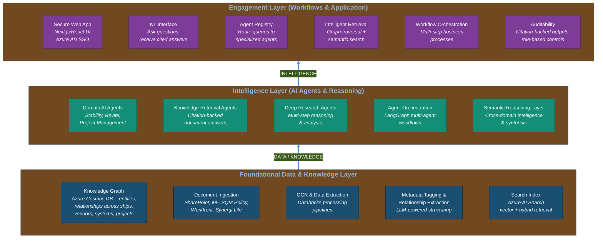
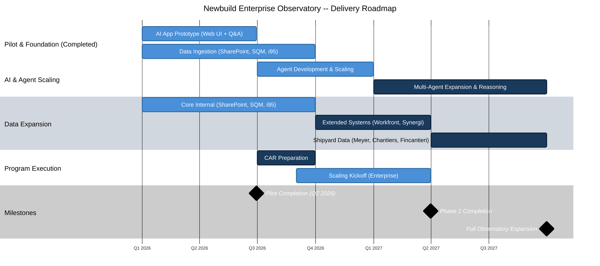

# Newbuild Enterprise Observatory -- Delivery Diagrams

## Diagram 1: Deliverable Architecture (Flowchart)

```mermaid
%%{init: {
  "theme": "base",
  "themeVariables": {
    "primaryColor": "#1a3a5c",
    "primaryTextColor": "#ffffff",
    "primaryBorderColor": "#0d2137",
    "lineColor": "#4a90d9",
    "fontSize": "14px"
  },
  "flowchart": {
    "htmlLabels": true
  }
}}%%

flowchart BT

  classDef spacer fill:none,stroke:none,color:transparent,width:0px,height:0px
  classDef navy fill:#1b4f72,stroke:#0d2137,color:#ffffff
  classDef green fill:#148f77,stroke:#0e6655,color:#ffffff
  classDef purple fill:#7d3c98,stroke:#512e5f,color:#ffffff

  subgraph DATA ["<span style='font-size:18px'><b>Foundational Data & Knowledge Layer</b></span>"]
    direction LR
    D0[ ]:::spacer
    D1["<div style='text-align:center'>Knowledge Graph<br/><i>Azure Cosmos DB -- entities,<br/>relationships across ships,<br/>vendors, systems, projects</i></div>"]:::navy
    D2["<div style='text-align:center'>Document Ingestion<br/><i>SharePoint, i95, SQM Policy,<br/>Workfront, Synergi Life</i></div>"]:::navy
    D3["<div style='text-align:center'>OCR & Data Extraction<br/><i>Databricks processing<br/>pipelines</i></div>"]:::navy
    D4["<div style='text-align:center'>Metadata Tagging &<br/>Relationship Extraction<br/><i>LLM-powered structuring</i></div>"]:::navy
    D5["<div style='text-align:center'>Search Index<br/><i>Azure AI Search<br/>vector + hybrid retrieval</i></div>"]:::navy
    D0 ~~~ D1 ~~~ D2 ~~~ D3 ~~~ D4 ~~~ D5
  end

  subgraph INTEL ["<span style='font-size:18px'><b>Intelligence Layer (AI Agents & Reasoning)</b></span>"]
    direction LR
    I0[ ]:::spacer
    I1["<div style='text-align:center'>Domain AI Agents<br/><i>Stability, Revite,<br/>Project Management</i></div>"]:::green
    I2["<div style='text-align:center'>Knowledge Retrieval Agents<br/><i>Citation-backed<br/>document answers</i></div>"]:::green
    I3["<div style='text-align:center'>Deep Research Agents<br/><i>Multi-step reasoning<br/>& analysis</i></div>"]:::green
    I4["<div style='text-align:center'>Agent Orchestration<br/><i>LangGraph multi-agent<br/>workflows</i></div>"]:::green
    I5["<div style='text-align:center'>Semantic Reasoning Layer<br/><i>Cross-domain intelligence<br/>& synthesis</i></div>"]:::green
    I0 ~~~ I1 ~~~ I2 ~~~ I3 ~~~ I4 ~~~ I5
  end

  subgraph APP ["<span style='font-size:18px'><b>Engagement Layer (Workflows & Application)</b></span>"]
    direction LR
    A0[ ]:::spacer
    A1["<div style='text-align:center'>Secure Web App<br/><i>Next.js/React UI<br/>Azure AD SSO</i></div>"]:::purple
    A2["<div style='text-align:center'>NL Interface<br/><i>Ask questions,<br/>receive cited answers</i></div>"]:::purple
    A3["<div style='text-align:center'>Agent Registry<br/><i>Route queries to<br/>specialized agents</i></div>"]:::purple
    A4["<div style='text-align:center'>Intelligent Retrieval<br/><i>Graph traversal +<br/>semantic search</i></div>"]:::purple
    A5["<div style='text-align:center'>Workflow Orchestration<br/><i>Multi-step business<br/>processes</i></div>"]:::purple
    A6["<div style='text-align:center'>Auditability<br/><i>Citation-backed outputs,<br/>role-based controls</i></div>"]:::purple
    A0 ~~~ A1 ~~~ A2 ~~~ A3 ~~~ A4 ~~~ A5 ~~~ A6
  end

  DATA =="DATA / KNOWLEDGE"==> INTEL
  INTEL =="INTELLIGENCE"==> APP

  linkStyle 16 stroke:#4a90d9,stroke-width:4px
  linkStyle 17 stroke:#4a90d9,stroke-width:4px
```

---

## Diagram 2: Multi-Year Delivery Roadmap (Gantt)

```mermaid
%%{init: {
  "theme": "base",
  "themeVariables": {
    "primaryColor": "#1a3a5c",
    "primaryTextColor": "#000000",
    "primaryBorderColor": "#0d2137",
    "lineColor": "#4a90d9",
    "fontSize": "14px",
    "sectionBkgColor": "#ffffff",
    "altSectionBkgColor": "#ffffff",
    "mainBkg": "#ffffff",
    "textColor": "#000000",
    "taskTextColor": "#ffffff",
    "taskTextOutsideColor": "#000000",
    "taskTextDarkColor": "#ffffff",
    "titleColor": "#000000",
    "todayLineColor": "transparent",
    "activeTaskBkgColor": "#4a90d9",
    "activeTaskBorderColor": "#2e6da4"
  },
  "gantt": {
    "useMaxWidth": false,
    "fontSize": 13,
    "sectionFontSize": 15,
    "barHeight": 32,
    "barGap": 8,
    "topPadding": 60,
    "rightPadding": 120,
    "leftPadding": 320,
    "numberSectionStyles": 5,
    "useWidth": 1350
  }
}}%%

gantt
  title Newbuild Enterprise Observatory -- Delivery Roadmap
  dateFormat YYYY-MM-DD
  axisFormat Q%q %Y
  tickInterval 3month

  section Pilot & Foundation (Completed)
    AI App Prototype (Web UI + Q&A)              :active, pilot1, 2026-01-01, 2026-06-30
    Data Ingestion (SharePoint, SQM, i95)        :active, pilot2, 2026-01-01, 2026-09-30

  section AI & Agent Scaling
    Agent Development & Scaling                  :active, ai1, 2026-07-01, 2026-12-31
    Multi-Agent Expansion & Reasoning            :ai2, 2027-01-01, 2027-09-30

  section Data Expansion
    Core Internal (SharePoint, SQM, i95)         :active, data1, 2026-01-01, 2026-09-30
    Extended Systems (Workfront, Synergi)         :data2, 2026-10-01, 2027-03-31
    Shipyard Data (Meyer, Chantiers, Fincantieri) :data3, 2027-04-01, 2027-09-30

  section Program Execution
    CAR Preparation                              :car1, 2026-07-01, 2026-09-30
    Scaling Kickoff (Enterprise)                 :active, scale1, 2026-09-01, 2027-03-31

  section Milestones
    Pilot Completion (Q2 2026)                   :active, milestone, m1, 2026-06-30, 0d
    Phase 1 Completion                           :milestone, m2, 2027-03-31, 0d
    Full Observatory Expansion                   :milestone, m3, 2027-09-30, 0d
```
