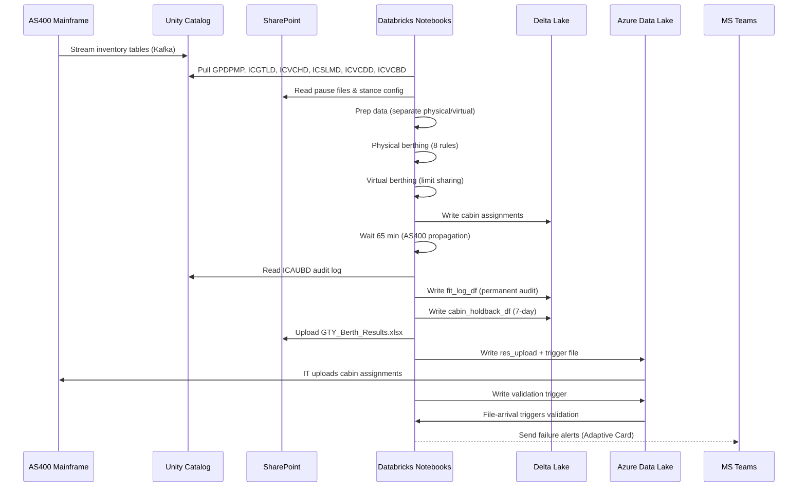

# DIAGRAM: INVENTORY-dbricks

## File Relationship Map

```mermaid
flowchart TD
    subgraph COMMON["COMMON/ — Shared Utilities"]
        SCHEMAS["Inventory_Table_Functions<br/>_And_Schemas.py"]
        SP["SharePoint.py"]
        TEAMS["Teams_Message.py"]
        WAIT["Wait.py"]
        ICON_RANK["Icon_Adj_Cat_Ranks.py"]
        NON_ICON["Non-Icon_Adj_Cat_Ranks.py"]
    end

    subgraph GTY_BERTH["GTY_BERTH/ — RCI FIT Berthing"]
        B01["01_pull_and_prep_data.py<br/>(Entry Point)"]
        B_UC["unity_catalog_pull_data.py"]
        B_PAUSE["pause_file.py"]
        B_PREP["prep_data.py"]
        B_RANK["cabin_ranking.py"]
        B02["02_physical.py"]
        B03["03_virtual.py"]
        B04["04_logging.py"]
    end

    subgraph GTY_GROUPS["GTY_GROUPS/ — RCI Group Berthing"]
        G01["01_pull_and_prep_data.py"]
        G02["02_berth.py"]
        G03["03_logging.py"]
        G04["04_teams.py"]
    end

    subgraph GTY_REPLENISH["GTY_REPLENISH/"]
        REP["replenish_main.py"]
        REP_LOG["replenish_logging.py"]
    end

    subgraph GTY_REBERTH["GTY_REBERTH/ — 12-Stage Pipeline"]
        REB_MAIN["REBERTHING_main<br/>_combined.py"]
        REB_01["01–12 Stage Notebooks"]
        REB_LOG["21_log.py"]
    end

    subgraph CEL["CEL_GTY_BERTH/"]
        CEL_01["cel_gty_fit_01.py"]
    end

    subgraph VALIDATION["Data_Validation/"]
        VAL["validation_checks.py"]
        VAL_NB["tables_validation.ipynb"]
        VAL_TRIG["validation_trigger.ipynb"]
        VAL_INI["workflow_tables.ini"]
    end

    subgraph EXTERNAL["External Systems"]
        UC[("Unity Catalog<br/>(AS400 Tables)")]
        SHAREPOINT[("SharePoint Online")]
        TEAMS_CH[("MS Teams")]
        AS400[("AS400 Upload<br/>res_upload.*")]
        ADLS[("Azure Data Lake")]
    end

    %% COMMON dependencies
    B01 -->|imports| SCHEMAS
    B01 -->|imports| SP
    B_UC -->|imports| SCHEMAS
    B_PAUSE -->|reads| SP
    B_RANK -->|imports| ICON_RANK
    B_RANK -->|imports| NON_ICON
    B04 -->|imports| SP
    B04 -->|imports| TEAMS

    G01 -->|imports| SCHEMAS
    G01 -->|imports| SP
    G04 -->|imports| TEAMS

    REP -->|imports| SCHEMAS
    REP -->|imports| SP

    CEL_01 -->|imports| SCHEMAS
    CEL_01 -->|imports| SP

    %% Internal workflow chains
    B01 -->|runs| B_UC
    B01 -->|runs| B_PAUSE
    B01 -->|runs| B_PREP
    B01 -->|output to| B02
    B_RANK -->|output to| B02
    B02 -->|output to| B03
    B03 -->|output to| WAIT
    WAIT -->|then| B04

    G01 -->|output to| G02
    G02 -->|output to| G03
    G03 -->|output to| G04

    REP -->|output to| REP_LOG

    REB_MAIN -->|runs sequentially| REB_01
    REB_01 -->|output to| REB_LOG

    %% External connections
    UC -->|reads| B_UC
    UC -->|reads| G01
    UC -->|reads| REP
    UC -->|reads| CEL_01
    UC -->|reads| REB_01

    SHAREPOINT -->|pause files| B_PAUSE
    SHAREPOINT -->|stance file| REP
    B04 -->|writes Excel| SHAREPOINT
    G04 -->|sends card| TEAMS_CH
    B04 -->|sends alert| TEAMS_CH

    B04 -->|writes cabins| AS400
    G03 -->|writes cabins| AS400
    REB_01 -->|writes cabins| AS400

    B04 -->|triggers| VAL_TRIG
    VAL_TRIG -->|writes trigger| ADLS
    ADLS -->|file arrival| VAL_NB
    VAL_NB -->|runs| VAL
    VAL_INI -->|config| VAL

    style COMMON fill:#e8f4fd,stroke:#004ecc
    style GTY_BERTH fill:#e6faf4,stroke:#10a4b7
    style GTY_GROUPS fill:#fff3e0,stroke:#e65100
    style GTY_REBERTH fill:#fce4ec,stroke:#c62828
    style VALIDATION fill:#f3e5f5,stroke:#6a1b9a
    style EXTERNAL fill:#f5f5f5,stroke:#616161
```

---

## Data Flow Diagram

```mermaid
sequenceDiagram
    participant AS400 as AS400 Mainframe
    participant UC as Unity Catalog
    participant SP as SharePoint
    participant NB as Databricks Notebooks
    participant DL as Delta Lake
    participant ADLS as Azure Data Lake
    participant Teams as MS Teams

    AS400->>UC: Stream inventory tables (Kafka)
    NB->>UC: Pull GPDPMP, ICGTLD, ICVCHD, ICSLMD, ICVCDD, ICVCBD
    NB->>SP: Read pause files & stance config
    NB->>NB: Prep data (separate physical/virtual)
    NB->>NB: Physical berthing (8 rules)
    NB->>NB: Virtual berthing (limit sharing)
    NB->>DL: Write cabin assignments
    NB->>NB: Wait 65 min (AS400 propagation)
    NB->>UC: Read ICAUBD audit log
    NB->>DL: Write fit_log_df (permanent audit)
    NB->>DL: Write cabin_holdback_df (7-day)
    NB->>SP: Upload GTY_Berth_Results.xlsx
    NB->>ADLS: Write res_upload + trigger file
    ADLS->>AS400: IT uploads cabin assignments
    NB->>ADLS: Write validation trigger
    ADLS->>NB: File-arrival triggers validation
    NB-->>Teams: Send failure alerts (Adaptive Card)
```
