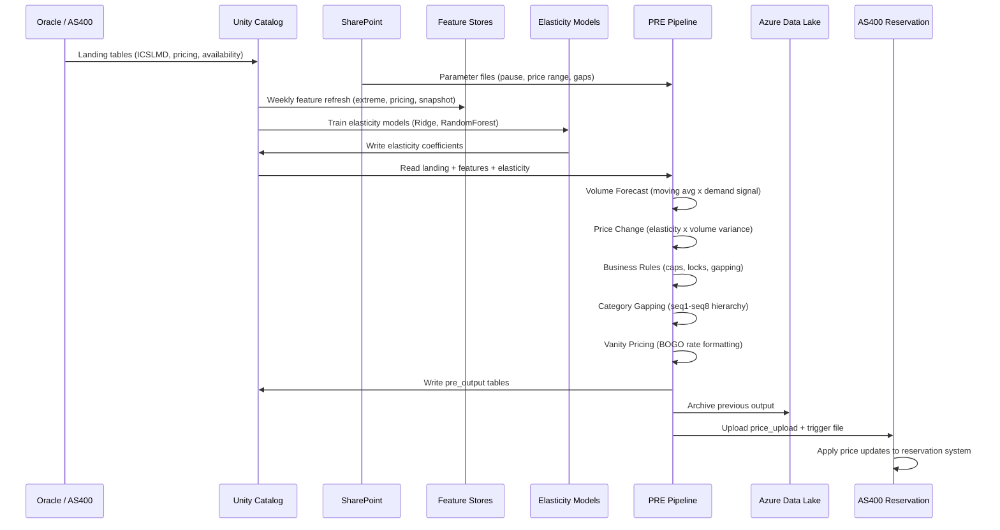

# DIAGRAM: PRE-dbricks

## File Relationship Map

```mermaid
flowchart TD
    subgraph CONFIG["Configuration Layer"]
        PRE_CFG["PRE_Configuration.py"]
        PARAMS["PRE_Parameters.py"]
        SCHEMA["DataFrame_Schema.py"]
        RW["DataFrame_ReaderAndWriter.py"]
        CHECKER["DataFrame_TableChecker.py"]
        SP["SharePoint.py"]
    end

    subgraph PREPROCESSING["Data Preprocessing"]
        DATA_READ["Data_Reader_Refactor.py"]
        PARAM_READ["Parameter_Reader.py"]
    end

    subgraph FEATURE_STORES["Feature Stores"]
        FS_CFG["fs_config_nb.py"]
        FS_EXTREME["fs_extreme_features"]
        FS_PRICING["fs_pricing_availability"]
        FS_SNAP["fs_snapshot_features"]
    end

    subgraph ELASTICITY["Elasticity Modeling"]
        MASTER["04_MASTER_DRIVER.ipynb"]
        TRAIN["TrainModelClass.py"]
        HELPERS["helpers/"]
    end

    subgraph MAIN_PRE["Core Pricing Logic"]
        VOL["Volume_Forecast.py"]
        PRICE_CHG["price_change_3_0.py"]
        BIZ_RULES["Business_Rules_Refactor.py"]
        FINAL_PR["Final_Prices.py"]
        OUTPUT_PR["Output_Prices.py"]
    end

    subgraph ENTRY["Pipeline Entry Points"]
        PIPE2["PRE_Pipeline2_MainRun.py<br/>(RCI Full)"]
        PL3["PRE_pl3.py<br/>(RCI Output)"]
        LITE["PRE_lite_main.py<br/>(CEL Lite)"]
        SSC["main_nb_monday.py<br/>(Seabourn)"]
    end

    subgraph UPLOAD["Upload & Delivery"]
        RCI_UP["PRE_pl3_rci_manual<br/>_price_upload.py"]
        CEL_UP["PRE_pl3_cel_manual<br/>_price_upload.py"]
    end

    subgraph EXTERNAL["External Systems"]
        UC[("Unity Catalog<br/>(Landing Tables)")]
        SHAREPOINT[("SharePoint<br/>(Parameters)")]
        ADLS[("Azure Data Lake")]
        AS400[("AS400 Reservation<br/>System")]
        MLFLOW[("MLflow<br/>Model Registry")]
    end

    %% Config dependencies
    PIPE2 -->|imports| PRE_CFG
    PRE_CFG -->|imports| SCHEMA
    PRE_CFG -->|imports| RW
    PRE_CFG -->|imports| CHECKER
    PRE_CFG -->|imports| PARAMS

    %% Preprocessing
    PIPE2 -->|runs| DATA_READ
    PIPE2 -->|runs| PARAM_READ
    DATA_READ -->|uses| RW
    DATA_READ -->|uses| SCHEMA
    PARAM_READ -->|reads| SP

    %% Feature stores
    PIPE2 -->|refreshes| FS_EXTREME
    PIPE2 -->|refreshes| FS_PRICING
    PIPE2 -->|refreshes| FS_SNAP
    FS_EXTREME -->|uses| FS_CFG
    FS_PRICING -->|uses| FS_CFG
    FS_SNAP -->|uses| FS_CFG

    %% Elasticity
    PIPE2 -->|triggers| MASTER
    MASTER -->|uses| TRAIN
    MASTER -->|uses| HELPERS
    TRAIN -->|logs| MLFLOW

    %% Core pricing
    PIPE2 -->|runs| VOL
    PIPE2 -->|runs| PRICE_CHG
    PIPE2 -->|runs| BIZ_RULES
    VOL -->|output to| PRICE_CHG
    PRICE_CHG -->|output to| BIZ_RULES
    BIZ_RULES -->|output to| FINAL_PR
    FINAL_PR -->|output to| OUTPUT_PR

    %% Output
    PIPE2 -->|output to| PL3
    PL3 -->|runs| FINAL_PR
    PL3 -->|runs| OUTPUT_PR
    PL3 -->|output to| RCI_UP
    LITE -->|runs| PRICE_CHG
    LITE -->|runs| BIZ_RULES
    LITE -->|output to| CEL_UP

    %% External
    UC -->|reads| DATA_READ
    UC -->|reads| PARAM_READ
    SHAREPOINT -->|parameters| PARAM_READ
    SHAREPOINT -->|parameters| LITE
    FS_EXTREME -->|reads/writes| UC
    FS_PRICING -->|reads/writes| UC
    MASTER -->|reads| UC

    RCI_UP -->|writes| AS400
    CEL_UP -->|writes| AS400
    PL3 -->|archives| ADLS
    SSC -->|writes| AS400

    style CONFIG fill:#e8f4fd,stroke:#004ecc
    style MAIN_PRE fill:#e6faf4,stroke:#10a4b7
    style ELASTICITY fill:#fff3e0,stroke:#e65100
    style FEATURE_STORES fill:#f3e5f5,stroke:#6a1b9a
    style ENTRY fill:#e8f5e9,stroke:#2e7d32
    style EXTERNAL fill:#f5f5f5,stroke:#616161
```

---

## Data Flow Diagram

```mermaid
sequenceDiagram
    participant Oracle as Oracle / AS400
    participant UC as Unity Catalog
    participant SP as SharePoint
    participant FS as Feature Stores
    participant EL as Elasticity Models
    participant PRE as PRE Pipeline
    participant ADLS as Azure Data Lake
    participant RES as AS400 Reservation

    Oracle->>UC: Landing tables (ICSLMD, pricing, availability)
    SP->>PRE: Parameter files (pause, price range, gaps)
    UC->>FS: Weekly feature refresh (extreme, pricing, snapshot)
    UC->>EL: Train elasticity models (Ridge, RandomForest)
    EL->>UC: Write elasticity coefficients
    UC->>PRE: Read landing + features + elasticity
    PRE->>PRE: Volume Forecast (moving avg x demand signal)
    PRE->>PRE: Price Change (elasticity x volume variance)
    PRE->>PRE: Business Rules (caps, locks, gapping)
    PRE->>PRE: Category Gapping (seq1-seq8 hierarchy)
    PRE->>PRE: Vanity Pricing (BOGO rate formatting)
    PRE->>UC: Write pre_output tables
    PRE->>ADLS: Archive previous output
    PRE->>RES: Upload price_upload + trigger file
    RES->>RES: Apply price updates to reservation system
```
