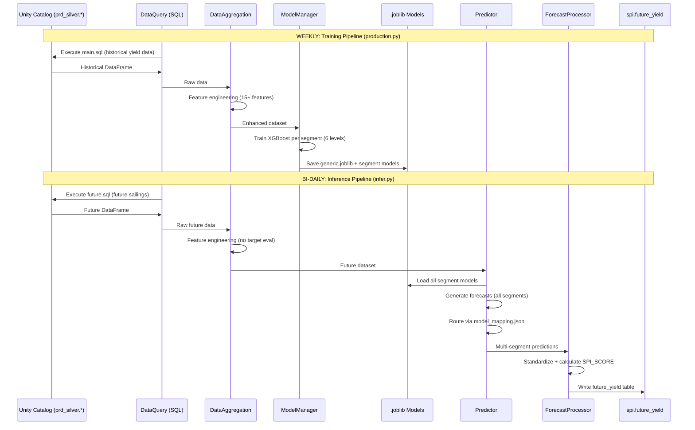

# DIAGRAM: SPI-dbricks

## File Relationship Map

```mermaid
flowchart TD
    subgraph HELPERS["helpers/ — Shared Utilities"]
        GENERIC["generic.py<br/>Config, merge, backtest"]
        TRANSFORMERS["transformers.py<br/>8 sklearn transformers"]
        TEMPORAL["temporal.py<br/>Sinusoidal encoding"]
        METRICS["metrics.py<br/>MAE, RMSE, R²"]
        QUANTILE["quantile.py<br/>AlignedQuantileLGBM"]
        HOLIDAY["holiday_check.py<br/>Regional holidays"]
        WEATHER["weather.py<br/>Open-Meteo API"]
        SHAP_E["shap_eval.py<br/>SHAP importance"]
        DP["data_push.py"]
    end

    subgraph CORE["Core ML Pipeline"]
        MODEL["model.py<br/>Pipeline, train, backtest"]
        PREPROC["preprocessing.py<br/>DataAggregation"]
        DQ["data_query.py<br/>SparkBase + DataQuery"]
    end

    subgraph PRODUCTION["Production (scoring/)"]
        PROD["production.py<br/>(Weekly Training)"]
        INFER["infer.py<br/>(Bi-daily Inference)"]
        INFERENCE["inference.py<br/>Predictor class"]
        MM["model_manager.py<br/>Segment training"]
        DT["data_translate.py<br/>ForecastProcessor"]
    end

    subgraph MODELS["Trained Models"]
        GLOBAL["generic.joblib"]
        BRAND_M["BRAND/*.joblib"]
        REGION_M["REGION/*.joblib"]
        PORT_M["ORIGINATING_PORT/*.joblib"]
        CLASS_M["SHIP_CLASS/*.joblib"]
        SHIP_M["SHIP_CODE/*.joblib"]
    end

    subgraph CONFIG["Configuration"]
        CFG_YAML["config.yaml"]
        MAP_JSON["model_mapping.json"]
    end

    subgraph EXTERNAL["External Systems"]
        UC[("Unity Catalog<br/>prd_silver.*")]
        SQL_FILES["query/*.sql"]
        OUTPUT[("spi.future_yield<br/>table")]
    end

    DQ -->|reads| SQL_FILES
    SQL_FILES -->|queries| UC
    PREPROC -->|uses| DQ
    MODEL -->|uses| PREPROC
    MODEL -->|uses| TRANSFORMERS
    MODEL -->|uses| TEMPORAL
    MODEL -->|uses| METRICS
    MODEL -->|uses| QUANTILE
    MODEL -->|uses| GENERIC

    PROD -->|uses| PREPROC
    PROD -->|uses| MM
    MM -->|uses| MODEL
    MM -->|saves| GLOBAL
    MM -->|saves| BRAND_M
    MM -->|saves| REGION_M
    MM -->|saves| PORT_M
    MM -->|saves| CLASS_M
    MM -->|saves| SHIP_M
    PROD -->|reads| CFG_YAML

    INFER -->|uses| PREPROC
    INFER -->|uses| INFERENCE
    INFERENCE -->|loads| GLOBAL
    INFERENCE -->|loads| BRAND_M
    INFERENCE -->|loads| REGION_M
    INFERENCE -->|loads| PORT_M
    INFERENCE -->|loads| CLASS_M
    INFERENCE -->|loads| SHIP_M
    INFERENCE -->|routes via| MAP_JSON
    INFER -->|uses| DT
    INFER -->|uses| DP
    DP -->|writes| OUTPUT

    UC -->|data| DQ

    style HELPERS fill:#f3e5f5,stroke:#6a1b9a
    style CORE fill:#e8f4fd,stroke:#004ecc
    style PRODUCTION fill:#e6faf4,stroke:#10a4b7
    style MODELS fill:#fff3e0,stroke:#e65100
    style CONFIG fill:#f5f5f5,stroke:#616161
    style EXTERNAL fill:#e8f5e9,stroke:#2e7d32
```

---

## Data Flow Diagram

```mermaid
sequenceDiagram
    participant UC as Unity Catalog (prd_silver.*)
    participant DQ as DataQuery (SQL)
    participant DA as DataAggregation
    participant MM as ModelManager
    participant MODELS as .joblib Models
    participant PRED as Predictor
    participant DT as ForecastProcessor
    participant OUT as spi.future_yield

    Note over UC,OUT: WEEKLY: Training Pipeline (production.py)
    DQ->>UC: Execute main.sql (historical yield data)
    UC->>DQ: Historical DataFrame
    DQ->>DA: Raw data
    DA->>DA: Feature engineering (15+ features)
    DA->>MM: Enhanced dataset
    MM->>MM: Train XGBoost per segment (6 levels)
    MM->>MODELS: Save generic.joblib + segment models

    Note over UC,OUT: BI-DAILY: Inference Pipeline (infer.py)
    DQ->>UC: Execute future.sql (future sailings)
    UC->>DQ: Future DataFrame
    DQ->>DA: Raw future data
    DA->>DA: Feature engineering (no target eval)
    DA->>PRED: Future dataset
    PRED->>MODELS: Load all segment models
    PRED->>PRED: Generate forecasts (all segments)
    PRED->>PRED: Route via model_mapping.json
    PRED->>DT: Multi-segment predictions
    DT->>DT: Standardize + calculate SPI_SCORE
    DT->>OUT: Write future_yield table
```
