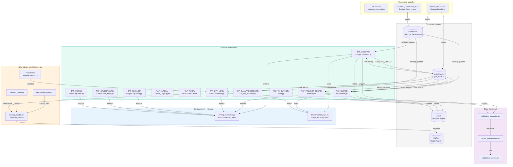
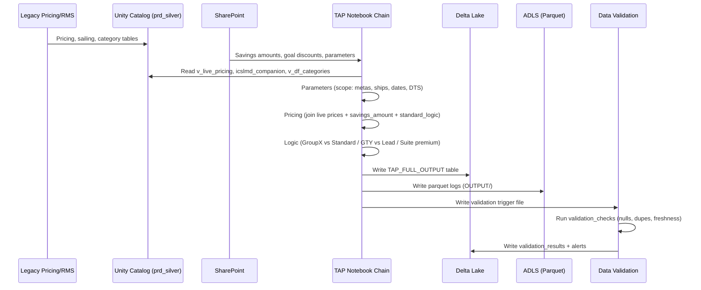

# DIAGRAM: TAP-CEL-dbricks

## File Relationship Map

```mermaid
flowchart TD
    subgraph CONFIG["Configuration/ — Shared"]
        PRICING_FN["Pricing_Functions.py<br/>BOGO, currency, tariff"]
        SP_SAVE["SharePointSavings.py<br/>Graph API integration"]
    end

    subgraph TAP_PRODUCTS["TAP Product Modules"]
        GROUPS["TAP_GROUPS/<br/>Groups TAP Main.py"]
        SUITES["TAP_SUITES/<br/>SuitesMain.py"]
        GTY_LEAD["TAP_GTY_LEAD/<br/>GTY-Lead Main.py"]
        SINGLES["TAP_SINGLES/<br/>Singles Tap Main.py"]
        ALASKA["TAP_ALASKA/<br/>Alaska_Logic.ipynb"]
        RIVER["TAP_RIVER/<br/>River Event Driven"]
        CRUISE["TAP_CRUISETOURS/<br/>CruiseTours_Main.py"]
        GALAP["TAP_GALAPAGOSTOURS/<br/>GT_Tap_Main.ipynb"]
        PERKS["TAP_PERKS/<br/>Perks Tap Main.py"]
        T4["TAP_T4_OUTLIER/<br/>Main.py"]
        SCOPE["TAP_PROJECT_SCOPE/<br/>Main.ipynb"]
    end

    subgraph ML["GTY_LEAD_MODELS/ — ML"]
        TRAIN_DATA["cel_training_data.py"]
        TRADEUP_CFG["tradeup_config.py"]
        TRADEUP_MDL["tradeup_model.py<br/>LogisticRegression"]
        VALIDATIONS["Validations/<br/>Pipeline validators"]
    end

    subgraph SUPPORT["Supporting Modules"]
        MOVEUP["MOVEUP/<br/>Upgrade optimization"]
        PRICE_HIST["PRICE_HISTORY/<br/>Historical tracking"]
        XD["STRIKE_THROUGH_XD/<br/>Exciting Deals promo"]
    end

    subgraph VALIDATION["Data_Validation/"]
        VAL_CHECKS["validation_checks.py"]
        VAL_TRIGGER["validation_trigger.ipynb"]
        VAL_NB["tables_validation.ipynb"]
    end

    subgraph EXTERNAL["External Systems"]
        UC[("Unity Catalog<br/>(prd_silver.*)")]
        SP[("SharePoint<br/>(Savings, Parameters)")]
        ADLS[("ADLS<br/>(Parquet output)")]
        MLFLOW_R[("MLflow<br/>Model Registry")]
    end

    GROUPS -->|imports| PRICING_FN
    SUITES -->|imports| PRICING_FN
    GTY_LEAD -->|imports| PRICING_FN
    SINGLES -->|imports| PRICING_FN
    CRUISE -->|imports| PRICING_FN
    PERKS -->|imports| PRICING_FN

    GROUPS -->|reads| SP_SAVE
    SUITES -->|reads| SP_SAVE
    GTY_LEAD -->|reads| SP_SAVE

    UC -->|live pricing| GROUPS
    UC -->|live pricing| SUITES
    UC -->|live pricing| GTY_LEAD
    UC -->|live pricing| ALASKA
    UC -->|sailing metadata| SCOPE
    SP -->|savings, params| GROUPS
    SP -->|savings, params| SUITES
    SP -->|savings, params| GTY_LEAD

    TRAIN_DATA -->|training data| TRADEUP_MDL
    TRADEUP_CFG -->|config| TRADEUP_MDL
    TRADEUP_MDL -->|registers| MLFLOW_R
    GTY_LEAD -->|uses model| TRADEUP_MDL
    VALIDATIONS -->|validates| GTY_LEAD

    GROUPS -->|writes| ADLS
    SUITES -->|writes| ADLS
    GTY_LEAD -->|writes| ADLS
    GROUPS -->|TAP_FULL_OUTPUT| UC
    SUITES -->|event output| UC

    GROUPS -->|triggers| VAL_TRIGGER
    SUITES -->|triggers| VAL_TRIGGER
    VAL_TRIGGER -->|file arrival| VAL_NB
    VAL_NB -->|runs| VAL_CHECKS

    PRICE_HIST -->|reads| UC
    PRICE_HIST -->|writes| SP
    XD -->|reads| SP

    style CONFIG fill:#e8f4fd,stroke:#004ecc
    style TAP_PRODUCTS fill:#e6faf4,stroke:#10a4b7
    style ML fill:#fff3e0,stroke:#e65100
    style VALIDATION fill:#f3e5f5,stroke:#6a1b9a
    style EXTERNAL fill:#f5f5f5,stroke:#616161
```

---

## Data Flow Diagram

```mermaid
sequenceDiagram
    participant LEGACY as Legacy Pricing/RMS
    participant UC as Unity Catalog (prd_silver)
    participant SP as SharePoint
    participant TAP as TAP Notebook Chain
    participant DL as Delta Lake
    participant ADLS as ADLS (Parquet)
    participant VAL as Data Validation

    LEGACY->>UC: Pricing, sailing, category tables
    SP->>TAP: Savings amounts, goal discounts, parameters
    TAP->>UC: Read v_live_pricing, icslmd_companion, v_df_categories
    TAP->>TAP: Parameters (scope: metas, ships, dates, DTS)
    TAP->>TAP: Pricing (join live prices + savings_amount + standard_logic)
    TAP->>TAP: Logic (GroupX vs Standard / GTY vs Lead / Suite premium)
    TAP->>DL: Write TAP_FULL_OUTPUT table
    TAP->>ADLS: Write parquet logs (OUTPUT/)
    TAP->>VAL: Write validation trigger file
    VAL->>VAL: Run validation_checks (nulls, dupes, freshness)
    VAL->>DL: Write validation_results + alerts
```
