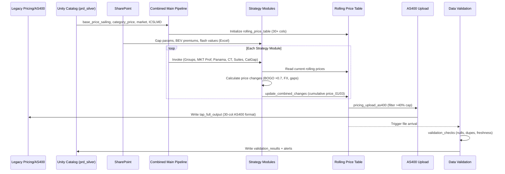

# DIAGRAM: TAP-RCI-dbricks

## File Relationship Map

```mermaid
flowchart TD
    subgraph COMMON["COMMON/ — Shared"]
        TAP_FN["tap_functions.py<br/>Schema + AS400 upload"]
        SP_FN["sharepoint_functions.py<br/>MS Graph API"]
        PRICE_UP["price_upload_functions.py"]
    end

    subgraph COMBINED["rci_tap_combined_structure/ — Master Pipeline"]
        MAIN["nb_rci_tap_combined_main.py<br/>Entry point"]
        PARAMS["nb_rci_tap_combined_parameters.py"]
        PREP["nb_rci_tap_combined_prep_data.py"]
        FUNCS["nb_rci_tap_combined_functions.py<br/>update_combined_changes()"]
    end

    subgraph STRATEGIES["Pricing Strategy Modules"]
        GROUPS["rci_tap_groups/<br/>Group gap pricing"]
        MKT["rci_tap_market_profitability/<br/>Multi-currency FX"]
        PANAMA["rci_tap_panama/<br/>BEV premiums"]
        CT["rci_tap_cruise_tours/<br/>Tour premiums"]
        SUITES_L["rci_tap_suites_lowering/"]
        SUITES_R["rci_tap_suites_raising/"]
        CAT_GAP["rci_tap_category_gapping/"]
        WTD["WTD_CHANGES/<br/>Week-to-date"]
    end

    subgraph ML["CATEGORY_GAPPING/ — ML"]
        TRADEUP["tradeup_model.py"]
        TRAIN["rci_training_data.py"]
    end

    subgraph GTY["GTY_LEAD_GAPPING/"]
        GTY_MAIN["GTY_GAP_MAIN.py"]
        GTY_OPT["GTY_LEAD_OPTIMIZATION.py"]
    end

    subgraph VALIDATION["Data_Validation/"]
        VAL_CHECKS["validation_checks.py"]
        VAL_TRIGGER["validation_trigger.ipynb"]
    end

    subgraph EXTERNAL["External Systems"]
        UC[("Unity Catalog<br/>(prd_silver.*)")]
        SP[("SharePoint<br/>(Gap Lists, BEV)")]
        ADLS[("ADLS<br/>(Parquet)")]
        AS400[("AS400<br/>Pricing System")]
    end

    MAIN --> PARAMS
    MAIN --> PREP
    MAIN --> FUNCS
    MAIN -->|calls| GROUPS
    MAIN -->|calls| MKT
    MAIN -->|calls| PANAMA
    MAIN -->|calls| CT
    MAIN -->|calls| SUITES_L
    MAIN -->|calls| SUITES_R
    MAIN -->|calls| CAT_GAP

    GROUPS -->|imports| TAP_FN
    MKT -->|imports| TAP_FN
    PANAMA -->|imports| TAP_FN
    CT -->|imports| TAP_FN
    SUITES_L -->|imports| TAP_FN
    SUITES_R -->|imports| TAP_FN

    GROUPS -->|reads| SP_FN
    MKT -->|reads| SP_FN
    PANAMA -->|reads| SP_FN
    CAT_GAP -->|reads| SP_FN

    PREP -->|reads| UC
    SP -->|gap params| SP_FN
    UC -->|live pricing| PREP

    FUNCS -->|writes| ADLS
    TAP_FN -->|upload| AS400

    CAT_GAP -->|uses| TRADEUP
    GTY_MAIN -->|uses| GTY_OPT
    TRAIN -->|feeds| TRADEUP

    MAIN -->|triggers| VAL_TRIGGER
    VAL_TRIGGER -->|runs| VAL_CHECKS

    style COMMON fill:#e8f4fd,stroke:#004ecc
    style COMBINED fill:#fff8e1,stroke:#f9a825
    style STRATEGIES fill:#e6faf4,stroke:#10a4b7
    style ML fill:#fff3e0,stroke:#e65100
    style VALIDATION fill:#f3e5f5,stroke:#6a1b9a
    style EXTERNAL fill:#f5f5f5,stroke:#616161
```

---

## Data Flow Diagram

```mermaid
sequenceDiagram
    participant LEGACY as Legacy Pricing/AS400
    participant UC as Unity Catalog (prd_silver)
    participant SP as SharePoint
    participant MAIN as Combined Main Pipeline
    participant STRAT as Strategy Modules
    participant RPT as Rolling Price Table
    participant AS4 as AS400 Upload
    participant VAL as Data Validation

    UC->>MAIN: base_price_sailing, category_price, market, ICSLMD
    MAIN->>RPT: Initialize rolling_price_table (30+ cols)
    SP->>STRAT: Gap params, BEV premiums, flash values (Excel)
    
    loop Each Strategy Module
        MAIN->>STRAT: Invoke (Groups, MKT Prof, Panama, CT, Suites, CatGap)
        STRAT->>RPT: Read current rolling prices
        STRAT->>STRAT: Calculate price changes (BOGO ×0.7, FX, gaps)
        STRAT->>RPT: update_combined_changes (cumulative price_01/03)
    end
    
    RPT->>AS4: pricing_upload_as400 (filter >40% cap)
    AS4->>LEGACY: Write tap_full_output (30-col AS400 format)
    RPT-->>VAL: Trigger file arrival
    VAL->>VAL: validation_checks (nulls, dupes, freshness)
    VAL->>UC: Write validation_results + alerts
```

---

## Combined Nightly Pipeline Flow

```mermaid
flowchart LR
    A["11:30 PM ET<br/>Mon/Thu/Fri"] --> B["Clear Checkpoints"]
    B --> C["Load Live Pricing<br/>(prep_data)"]
    C --> D["Init rolling_price_table"]
    D --> E{"Timezone<br/>Routing"}
    E -->|Noon ET| F["AUST/NZL/SOPAC"]
    E -->|Other| G["14 Meta-Products"]
    F --> H
    G --> H["Groups"]
    H --> I["Market Prof"]
    I --> J["Category Gap"]
    J --> K["Suites Lower"]
    K --> L["Suites Raise"]
    L --> M["Cruise Tours"]
    M --> N["Panama"]
    N --> O["pricing_upload_as400<br/>Cap ±40%"]
    O --> P["tap_full_output"]
    O --> Q["tap_exceptions"]
    P --> R["Data Validation"]
```
