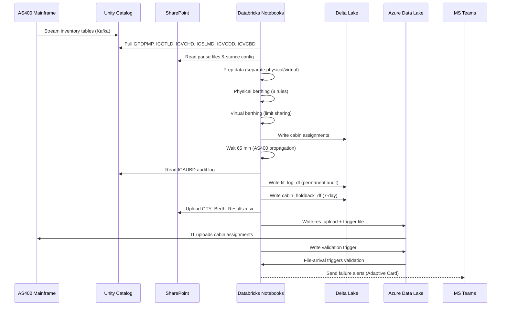

# OVERVIEW: INVENTORY-dbricks

## 1. Project Overview

| Field | Detail |
|-------|--------|
| **Project Name** | INVENTORY-dbricks (RMA Inventory Automation) |
| **Purpose** | Automates cruise ship cabin guarantee (GTY) berthing, reberthing, replenishment, and inventory management for both Royal Caribbean International (RCI) and Celebrity Cruises. Places passengers holding guarantee bookings into specific cabins using rule-based matching algorithms. |
| **Tech Stack** | Databricks (Azure), PySpark, Python 3.x, Delta Lake, Unity Catalog, Microsoft Graph API (SharePoint), Microsoft Teams (Adaptive Cards), Azure Key Vault, Azure DevOps CI/CD |
| **Entry Points** | Each workflow has its own entry-point notebook orchestrated by Databricks Jobs defined in `resources/*.yml`. Key entry points: `GTY_BERTH/nb_rci_gty_berth_01_pull_and_prep_data.py`, `GTY_GROUPS/nb_rci_gty_groups_01_pull_and_prep_data.py`, `GTY_REBERTH/REBERTHING_main_combined.py`, `GTY_REPLENISH/nb_rci_gty_replenish_main.py`, `CEL_GTY_BERTH/nb_cel_gty_fit_01_pull_and_prep_data.py` |
| **Deployment Targets** | **Dev**: `adb-3692873619125232.12` / **QA**: `adb-2056111555648428.8` / **Prod**: `adb-7486609540090573.13` |
| **Dependencies** | `pyspark`, `msal`, `requests`, `pandas`, `openpyxl`, `xlsxwriter`, `pytz`, `dbutils` |

---

## 2. Directory Structure

```
INVENTORY-dbricks/
├── databricks.yml                        # Bundle config — 3 deployment targets (dev/qa/prd)
├── .gitignore                            # Git ignore rules
│
├── COMMON/                               # Shared utility modules (7 files)
│   ├── Inventory_Table_Functions_And_Schemas.py   # Core AS400 table schemas & load functions
│   ├── SharePoint.py                     # MS Graph API integration (MSAL auth, file I/O)
│   ├── Teams_Message.py                  # Adaptive Card generation & Teams webhook posting
│   ├── Wait.py                           # Configurable sleep/pause utility
│   ├── Icon_Adj_Cat_Ranks.py            # Icon-class ship category ranking (1–68 scale)
│   ├── Non-Icon_Adj_Cat_Ranks.py        # Non-Icon ship category ranking
│   └── Retired_SharePoint_Delete_After_2026-04-30.py  # Deprecated legacy SharePoint module
│
├── GTY_BERTH/                            # RCI FIT guarantee berthing (8 files)
│   ├── nb_rci_gty_berth_01_pull_and_prep_data.py  # Entry point — orchestrates pipeline
│   ├── nb_rci_gty_berth_02_physical.py   # Physical GTY berthing (8 rules)
│   ├── nb_rci_gty_berth_03_virtual.py    # Virtual GTY berthing (inventory sharing)
│   ├── nb_rci_gty_berth_04_logging.py    # Audit logging & SharePoint Excel report
│   ├── nb_rci_gty_berth_cabin_ranking.py # Merge category ranks with cabin data
│   ├── nb_rci_gty_berth_pause_file.py    # Load pause config from SharePoint
│   ├── nb_rci_gty_berth_prep_data.py     # Data cleaning & transformation
│   └── nb_rci_gty_berth_unity_catalog_pull_data.py  # Load raw tables from Unity Catalog
│
├── GTY_REPLENISH/                        # RCI GTY replenishment (2 files)
│   ├── nb_rci_gty_replenish_main.py      # Entry point — stance-driven replenishment
│   └── nb_rci_gty_replenish_logging.py   # Replenishment results logging
│
├── GTY_GROUPS/                           # RCI group GTY berthing (9 files)
│   ├── nb_rci_gty_groups_01_pull_and_prep_data.py  # Entry point — group berthing pipeline
│   ├── nb_rci_gty_groups_02_berth.py     # Group berthing logic (8 rules)
│   ├── nb_rci_gty_groups_03_logging.py   # Group berthing audit logging
│   ├── nb_rci_gty_groups_04_teams.py     # Send results to Teams channel
│   ├── nb_rci_gty_groups_cabin_ranking.py
│   ├── nb_rci_gty_groups_pause_file.py
│   ├── nb_rci_gty_groups_prep_data.py
│   ├── nb_rci_gty_groups_unity_catalog_pull_data.py
│   └── one_time_log_sync.py             # One-time log synchronization utility
│
├── GTY_REBERTH/                          # RCI reberthing — 12-stage pipeline (14 files)
│   ├── REBERTHING_main_combined.py       # Orchestrator — runs 12 sequential stages
│   ├── rci_01_REBERTHING_pull_data.py    # Stage 1: Load voyages/bookings/cabins
│   ├── rci_02_REBERTHING_prep_data.py    # Stage 2: Clean and prepare data
│   ├── rci_03_REBERTHING_pause_files.py  # Stage 3: Load pause configuration
│   ├── rci_04_REBERTHING_sz_swap.py      # Stage 4: Safety zone cabin swaps
│   ├── rci_05_REBERTHING_reprep_data.py  # Stage 5: Re-prepare data after swaps
│   ├── rci_06_REBERTHING_match_from.py   # Stage 6: Identify source ("FROM") cabins
│   ├── rci_07_REBERTHING_match_to.py     # Stage 7: Identify destination ("TO") cabins
│   ├── rci_08_REBERTHING_cabin_moves.py  # Stage 8: Calculate cabin movements
│   ├── rci_09_REBERTHING_sz_check.py     # Stage 9: Validate safety zone constraints
│   ├── rci_10_REBERTHING_validate.py     # Stage 10: Final validation
│   ├── rci_11_REBERTHING_upload_cabins_GTY.py  # Stage 11: Upload GTY cabin assignments
│   ├── rci_12_REBERTHING_upload_cabins_NEW.py  # Stage 12: Upload new cabin assignments
│   └── rci_21_REBERTHING_log.py          # Stage 13: Log reberthing results
│
├── GTY_ACCESSIBLE/                       # Accessible cabin release (5 files)
│   ├── nb_01_rci_identify_and_release_accessibles.py
│   ├── nb_02_cel_identify_and_release_accessibles.py
│   ├── nb_03_accessible_exact_berth.py
│   ├── nb_04_accessible_logging.py
│   └── nb_05_accessible_teams.py
│
├── LIVE_GTY_ACCESSIBLE/                  # Live accessible cabin tracking (3 files)
│   ├── nb_01_rci_identify_and_release_accessibles.py
│   ├── nb_02_cel_identify_and_release_accessibles.py
│   └── nb_03_accessible_exact_berth.py
│
├── GTY_DEBERTH/                          # Deberthing operations (7 files)
│   ├── berthed_success.py
│   ├── nb_exact_berth.py / nb_exact_berth_LE.py
│   ├── nb_recategorize_berth.py / nb_recategorize_deberth.py / nb_recategorize_deberth_LE.py
│   ├── nb_recategorize_status_change.py
│   └── TEST_Reassign_Cabins_xx.py
│
├── GTY_SAFETY_ZONE_REBERTH/             # Safety zone reberthing (8 files)
│   ├── nb_01–08_rci_safety_zone_*.py     # Main → pull → prep → pause → swap → status → cabin → log
│
├── AS400_GTY_SAFETY_ZONE_REBERTH/       # AS400 safety zone reberthing variant (8 files)
│
├── CEL_GTY_BERTH/                        # Celebrity FIT GTY berthing (4 files)
│   └── nb_cel_gty_fit_01_pull_and_prep_data.py  # Entry point (Mon–Sat 21:30 ET)
│
├── CEL_GTY_REPLENISH/                    # Celebrity replenishment (3 files)
├── CEL_GTY_GROUPS/                       # Celebrity group berthing (4 files)
├── CEL_GTY_REBERTH/                      # Celebrity reberthing (3 files)
├── CEL_MANDATORY_OCC/                    # Celebrity mandatory occupancy (3 files)
├── CEL_GROUP_REPLENISH/                  # Celebrity group replenishment
│
├── MANDATORY_OCC/                        # RCI mandatory occupancy test (1 file)
├── BUSY_BERTHING/                        # Busy berthing test suite (5 files)
├── HISTORIC_T4/                          # Historical T4 utilization analysis (4 files)
├── OPTION_CHANGE/                        # Option change logic test (1 file)
├── SPI_GRP_GTY_RECS/                     # SPI group GTY limit calculations (1 file)
├── T4_FIT_GTY_REPLENISH/                # T4 FIT replenishment utility (1 file)
├── T4_LIMITS/                            # T4 limits tracking (3 files)
├── B2B_PAX_REBERTHING (GTY & PHY)/      # B2B passenger reberthing (4 files)
│
├── Data_Validation/                      # QA validation framework (5 files)
│   ├── validation_checks.py             # Core framework (nulls, PK dupes, freshness, cardinality)
│   ├── tables_validation.ipynb          # Notebook wrapper — file-arrival trigger
│   ├── validation_trigger.ipynb         # Write trigger file to kick off validation
│   ├── tables_extractor.py             # Extract table list for validation
│   └── workflow_tables.ini             # Config: table names + validation columns
│
├── IA_QA_Testing_Uploads/               # QA test suite (14 files)
│   ├── configuration_settings.py        # Environment mapping & helpers
│   ├── QA_Test_Main.py                  # Master QA runner
│   └── tables/                          # Per-table QA assertions (12 files)
│
└── resources/                            # Databricks workflow YAML definitions (25 files)
    ├── rci_inventory_gty_berth.yml      # RCI FIT GTY (daily 21:50 ET)
    ├── cel_inventory_gty_berth.yml      # Celebrity GTY (Mon–Sat 21:30 ET)
    ├── rci_inventory_gty_groups.yml     # RCI group GTY
    ├── Inventory_Data_validation.yml    # Data validation (file-arrival trigger)
    └── ... (20+ additional workflows)
```

---

## 3. File-by-File Breakdown

### COMMON/ — Shared Utility Modules

| Field | `Inventory_Table_Functions_And_Schemas.py` |
|---|---|
| **Purpose** | Core library defining all AS400 inventory table schemas and a generic data loading function used by every workflow. |
| **Inputs** | Unity Catalog coordinates (`catalog`, `schema`, `table`), sailing date column name |
| **Outputs** | PySpark DataFrames with enforced schemas for 7 tables: GPDPMP, ICGTLD, ICVCHD, ICSLMD, ICVCDD, ICVCBD, ICOMLD |
| **Key Functions** | `load_inventory_table(uc_catalog, uc_schema, uc_tablename, saildate_col)` — loads with date filtering; `enforce_schema(col, df_schema)` — type enforcement |
| **Dependencies** | `pyspark.sql`, Databricks Unity Catalog |

| Field | `SharePoint.py` |
|---|---|
| **Purpose** | Modern Microsoft Graph API integration for reading/writing files to SharePoint Online. Handles authentication via MSAL service principal. |
| **Inputs** | SharePoint site URLs, file paths, Azure Key Vault secrets (`DataScience-PowerBI-RefreshAPI-appid-sp`, `DataScience-PowerBI-RefreshAPI-key-sp`, `TenantID`) |
| **Outputs** | Files read from / written to SharePoint; Excel DataFrames via pandas |
| **Key Functions** | `_get_sharepoint_token()`, `authenticate_app()`, `_sp_get()`, `_get_site_id()`, `_strip_library_prefix()` |
| **Dependencies** | `msal`, `requests`, `pandas`, `urllib.parse`, `dbutils.secrets` |

| Field | `Teams_Message.py` |
|---|---|
| **Purpose** | Generates and sends Microsoft Teams Adaptive Card notifications with formatted tables for berthing results or error alerts. |
| **Inputs** | Spark DataFrames (errors, metrics), message configuration (title, subtitle, column widths) |
| **Outputs** | HTTP POST to Teams webhook with Adaptive Card v1.5 JSON payload |
| **Key Functions** | `create_adaptive_card()` — DataFrame to Adaptive Card JSON; `send_adaptive_card()` — POST to webhook |
| **Dependencies** | `requests`, `json`, `dbutils` |

| Field | `Wait.py` |
|---|---|
| **Purpose** | Pauses workflow execution between tasks to allow AS400 logging propagation (default 300 seconds). |
| **Inputs** | `sleep_seconds` widget parameter |
| **Outputs** | Delayed execution (time.sleep) |
| **Dependencies** | Python `time` |

| Field | `Icon_Adj_Cat_Ranks.py` / `Non-Icon_Adj_Cat_Ranks.py` |
|---|---|
| **Purpose** | Static category ranking tables (1–68 preference scale) for cabin matching. Icon version for ships IC, ST, LE, HE; Non-Icon for all others. Maintained by business (Joanna). |
| **Inputs** | Static tuples (BRAND, CAT_CLASS, CAT_TYPE_RANK, CAT_TYPE, CATEGORY, CAT_RANK, OCCUPANCY, BERTH_OCCUPANCY) |
| **Outputs** | PySpark DataFrame with `CABIN_RANK` column |
| **Dependencies** | `pyspark.sql` |

### GTY_BERTH/ — RCI FIT Guarantee Berthing (Core Module)

| Field | `nb_rci_gty_berth_01_pull_and_prep_data.py` |
|---|---|
| **Purpose** | **Entry point** for the RCI FIT guarantee berthing pipeline. Orchestrates sub-notebooks to pull data from Unity Catalog, load pause files from SharePoint, and prepare physical/virtual booking DataFrames. |
| **Inputs** | Unity Catalog tables (GPDPMP, ICGTLD, ICVCHD, ICSLMD, ICVCDD, ICVCBD), SharePoint pause file, `catalog_env` widget |
| **Outputs** | `physical_df`, `final_phys_cabins_df`, `virtual_df`, `final_virt_cabins_df`, `limit_final_df` |
| **Key Functions** | Runs sub-notebooks: `*_unity_catalog_pull_data`, `*_pause_file`, `*_prep_data` |
| **Dependencies** | COMMON/Inventory_Table_Functions_And_Schemas, COMMON/SharePoint |

| Field | `nb_rci_gty_berth_02_physical.py` |
|---|---|
| **Purpose** | Physical guarantee berthing — places bookings into exact-match or +1 category cabins using 8 progressive rules. Tracks safety zone constraints per muster station/deck. |
| **Inputs** | `physical_df`, `final_phys_cabins_df`, cabin rank DataFrame |
| **Outputs** | Matched cabin assignments (8 rule outputs), updated cabin availability |
| **Key Functions** | Rules 01–08 (P Exact, S→D/T→Q, +1 Exact, Icon-specific rules); broadcast joins; row_number windowing |
| **Dependencies** | `*_cabin_ranking.py`, Icon/Non-Icon rank data |

| Field | `nb_rci_gty_berth_03_virtual.py` |
|---|---|
| **Purpose** | Virtual guarantee berthing with inventory limit sharing. Calculates booking position limits (BK_POS_LIMIT) with ship-specific reduction formulas, then allocates cabins proportionally. |
| **Inputs** | `virtual_df`, `final_virt_cabins_df`, `limit_final_df`, physical match results |
| **Outputs** | Virtual cabin assignments, proportions DataFrame, limit calculations |
| **Key Functions** | BK_POS_LIMIT calculation (10–30% reduction by ship class), BK_SHARE allocation, Rule 09 V Exact |
| **Dependencies** | Physical results, AS400 limits |

| Field | `nb_rci_gty_berth_04_logging.py` |
|---|---|
| **Purpose** | Post-execution audit logging. Reads AS400 ICAUBD table (cabin assignment audit), writes permanent `fit_log_df`, generates Excel report to SharePoint, tracks failed cabins in 7-day holdback. |
| **Inputs** | Berthing results (physical + virtual), ICAUBD audit table |
| **Outputs** | `fit_log_df` (permanent Delta), `cabin_holdback_df` (7-day hold), SharePoint Excel `GTY_Berth_Results_{date}.xlsx` |
| **Dependencies** | COMMON/SharePoint, COMMON/Teams_Message |

### GTY_REPLENISH/ — RCI GTY Replenishment

| Field | `nb_rci_gty_replenish_main.py` |
|---|---|
| **Purpose** | **Entry point** for RCI guarantee replenishment. Reads manager-controlled stance file from SharePoint (neutral/aggressive/defensive) and adjusts inventory oversell percentages per ship/sailing/category. |
| **Inputs** | SharePoint Excel `GTY_Replenish_Param.xlsx`, inventory tables (ICSLMD_COMPANION), pause file |
| **Outputs** | Replenished inventory levels, updated pause state |
| **Key Functions** | Stance logic (MAX_OVERSELL_PCT), pause tracking, Icon ship handling |
| **Dependencies** | COMMON/SharePoint, COMMON/Inventory_Table_Functions_And_Schemas |

### GTY_GROUPS/ — RCI Group GTY Berthing

| Field | `nb_rci_gty_groups_01_pull_and_prep_data.py` |
|---|---|
| **Purpose** | **Entry point** for RCI group guarantee berthing. Same 3-stage structure as FIT (pull → physical berth → log). |
| **Inputs** | Group booking inventory tables, Unity Catalog, SharePoint pause files |
| **Outputs** | `physical_df`, `final_phys_cabins_df`, `virtual_df`, group berthing assignments |
| **Dependencies** | COMMON/*, same pattern as GTY_BERTH |

### GTY_REBERTH/ — 12-Stage Reberthing Pipeline

| Field | `REBERTHING_main_combined.py` |
|---|---|
| **Purpose** | **Orchestrator** for the 12-stage reberthing pipeline. Moves guests between cabins while maintaining safety zone constraints. Runs stages sequentially via `dbutils.notebook.run()`. |
| **Inputs** | Voyage/booking/cabin data from Unity Catalog, pause config, safety zone definitions |
| **Outputs** | Cabin moves uploaded to `{env}_bronze.res_upload.icvcbd`, reberthing log |
| **Stages** | 01: Pull data → 02: Prep → 03: Pause → 04: SZ swap → 05: Re-prep → 06: Match FROM → 07: Match TO → 08: Moves → 09: SZ check → 10: Validate → 11: Upload GTY → 12: Upload NEW → 21: Log |
| **Dependencies** | All `rci_01–12_*.py` files, COMMON/* |

### CEL Modules — Celebrity Cruises

| Field | `CEL_GTY_BERTH/nb_cel_gty_fit_01_pull_and_prep_data.py` |
|---|---|
| **Purpose** | Celebrity FIT guarantee berthing (31+ days out). Filters for BRAND = 'C', excludes ships RS/RC, excludes Galapagos/River products. |
| **Inputs** | Same inventory tables filtered for Celebrity brand |
| **Outputs** | Celebrity cabin assignments |
| **Schedule** | Mon–Sat 21:30 ET |
| **Schema** | `{env}_revenue_mgmt_bu.cel_ia_gty_berth` |

### Data_Validation/ — QA Validation Framework

| Field | `validation_checks.py` |
|---|---|
| **Purpose** | Comprehensive data quality framework. Checks NULL percentages, primary key duplicates, row-level hash duplicates, schema snapshots, data freshness, categorical profiling, and type consistency. |
| **Inputs** | Table names from `workflow_tables.ini`, Unity Catalog tables |
| **Outputs** | `validation_results` DataFrame, `validation_alerts` DataFrame |
| **Key Classes** | `ValidationRunnerHistory` |
| **Dependencies** | `pyspark`, `configparser`, `sha2` hashing |

### IA_QA_Testing_Uploads/ — QA Test Suite

| Field | `QA_Test_Main.py` |
|---|---|
| **Purpose** | Master QA test runner. Loads CSV test data from ADLS, creates temp views, runs per-table QA notebooks, writes results to `{env}_bronze.res_upload.*`, triggers IT file notification. |
| **Inputs** | CSV test data from ADLS, per-table QA notebooks in `tables/` |
| **Outputs** | Validated data in `{env}_bronze.res_upload.{table}`, trigger files for AS400 upload |
| **Dependencies** | `configuration_settings.py`, 12 `*_QA.py` table test files |

### resources/ — Workflow YAML Definitions (25 files)

Each YAML file defines a Databricks Job with schedule, task chain, cluster config, retries, and notifications. Key workflows:

| Workflow YAML | Schedule | Pipeline |
|---|---|---|
| `rci_inventory_gty_berth.yml` | Daily 21:50 ET | pull → physical → virtual → wait 65min → logging → validation |
| `cel_inventory_gty_berth.yml` | Mon–Sat 21:30 ET | pull → berth → wait 65min → logging → validation |
| `rci_inventory_gty_groups.yml` | Daily | pull → berth → log → teams |
| `rci_inventory_gty_replenish.yml` | Regular | Stance-driven replenishment |
| `Inventory_Data_validation.yml` | File-arrival trigger | Full table validation suite |

---

## 4. File Relationship Map

```mermaid
flowchart TD
    subgraph COMMON["COMMON/ — Shared Utilities"]
        SCHEMAS["Inventory_Table_Functions<br/>_And_Schemas.py"]
        SP["SharePoint.py"]
        TEAMS["Teams_Message.py"]
        WAIT["Wait.py"]
        ICON_RANK["Icon_Adj_Cat_Ranks.py"]
        NON_ICON["Non-Icon_Adj_Cat_Ranks.py"]
    end

    subgraph GTY_BERTH["GTY_BERTH/ — RCI FIT Berthing"]
        B01["01_pull_and_prep_data.py<br/>(Entry Point)"]
        B_UC["unity_catalog_pull_data.py"]
        B_PAUSE["pause_file.py"]
        B_PREP["prep_data.py"]
        B_RANK["cabin_ranking.py"]
        B02["02_physical.py"]
        B03["03_virtual.py"]
        B04["04_logging.py"]
    end

    subgraph GTY_GROUPS["GTY_GROUPS/ — RCI Group Berthing"]
        G01["01_pull_and_prep_data.py"]
        G02["02_berth.py"]
        G03["03_logging.py"]
        G04["04_teams.py"]
    end

    subgraph GTY_REPLENISH["GTY_REPLENISH/"]
        REP["replenish_main.py"]
        REP_LOG["replenish_logging.py"]
    end

    subgraph GTY_REBERTH["GTY_REBERTH/ — 12-Stage Pipeline"]
        REB_MAIN["REBERTHING_main<br/>_combined.py"]
        REB_01["01–12 Stage Notebooks"]
        REB_LOG["21_log.py"]
    end

    subgraph CEL["CEL_GTY_BERTH/"]
        CEL_01["cel_gty_fit_01.py"]
    end

    subgraph VALIDATION["Data_Validation/"]
        VAL["validation_checks.py"]
        VAL_NB["tables_validation.ipynb"]
        VAL_TRIG["validation_trigger.ipynb"]
        VAL_INI["workflow_tables.ini"]
    end

    subgraph EXTERNAL["External Systems"]
        UC[("Unity Catalog<br/>(AS400 Tables)")]
        SHAREPOINT[("SharePoint Online")]
        TEAMS_CH[("MS Teams")]
        AS400[("AS400 Upload<br/>res_upload.*")]
        ADLS[("Azure Data Lake")]
    end

    %% COMMON dependencies
    B01 -->|imports| SCHEMAS
    B01 -->|imports| SP
    B_UC -->|imports| SCHEMAS
    B_PAUSE -->|reads| SP
    B_RANK -->|imports| ICON_RANK
    B_RANK -->|imports| NON_ICON
    B04 -->|imports| SP
    B04 -->|imports| TEAMS

    G01 -->|imports| SCHEMAS
    G01 -->|imports| SP
    G04 -->|imports| TEAMS

    REP -->|imports| SCHEMAS
    REP -->|imports| SP

    CEL_01 -->|imports| SCHEMAS
    CEL_01 -->|imports| SP

    %% Internal workflow chains
    B01 -->|runs| B_UC
    B01 -->|runs| B_PAUSE
    B01 -->|runs| B_PREP
    B01 -->|output to| B02
    B_RANK -->|output to| B02
    B02 -->|output to| B03
    B03 -->|output to| WAIT
    WAIT -->|then| B04

    G01 -->|output to| G02
    G02 -->|output to| G03
    G03 -->|output to| G04

    REP -->|output to| REP_LOG

    REB_MAIN -->|runs sequentially| REB_01
    REB_01 -->|output to| REB_LOG

    %% External connections
    UC -->|reads| B_UC
    UC -->|reads| G01
    UC -->|reads| REP
    UC -->|reads| CEL_01
    UC -->|reads| REB_01

    SHAREPOINT -->|pause files| B_PAUSE
    SHAREPOINT -->|stance file| REP
    B04 -->|writes Excel| SHAREPOINT
    G04 -->|sends card| TEAMS_CH
    B04 -->|sends alert| TEAMS_CH

    B04 -->|writes cabins| AS400
    G03 -->|writes cabins| AS400
    REB_01 -->|writes cabins| AS400

    B04 -->|triggers| VAL_TRIG
    VAL_TRIG -->|writes trigger| ADLS
    ADLS -->|file arrival| VAL_NB
    VAL_NB -->|runs| VAL
    VAL_INI -->|config| VAL

    style COMMON fill:#e8f4fd,stroke:#004ecc
    style GTY_BERTH fill:#e6faf4,stroke:#10a4b7
    style GTY_GROUPS fill:#fff3e0,stroke:#e65100
    style GTY_REBERTH fill:#fce4ec,stroke:#c62828
    style VALIDATION fill:#f3e5f5,stroke:#6a1b9a
    style EXTERNAL fill:#f5f5f5,stroke:#616161
```



---

## 5. Data Flow

### End-to-End Data Flow (RCI FIT GTY Berthing — Primary Workflow)

1. **Source**: AS400 mainframe streams inventory data via Kafka into Unity Catalog (`prd_silver.dpc_pssmmx.*` tables: GPDPMP, ICGTLD, ICVCHD, ICSLMD, ICVCDD, ICVCBD)
2. **Pull**: `nb_rci_gty_berth_unity_catalog_pull_data.py` loads tables with date filtering and schema enforcement
3. **Config**: `nb_rci_gty_berth_pause_file.py` reads SharePoint Excel pause files to determine which categories are paused
4. **Prep**: `nb_rci_gty_berth_prep_data.py` cleans data, separates physical vs. virtual guarantees, builds cabin availability frames
5. **Physical Berth**: `02_physical.py` applies 8 progressive matching rules (exact category → +1 category)
6. **Virtual Berth**: `03_virtual.py` calculates inventory sharing limits (BK_POS_LIMIT with ship-specific reductions), allocates proportionally
7. **Wait**: 65-minute pause for AS400 audit log propagation
8. **Logging**: `04_logging.py` reads ICAUBD audit table, writes `fit_log_df` (permanent), `cabin_holdback_df` (7-day), Excel to SharePoint
9. **Upload**: Cabin assignments written to `{env}_bronze.res_upload.icvcbd` → trigger file to ADLS → IT process uploads to AS400
10. **Validation**: `validation_trigger.ipynb` writes checkpoint → file-arrival trigger runs `validation_checks.py`
11. **Notifications**: Teams Adaptive Cards sent on failure; email alerts to kclark@, abonzano@



---

## 6. Configuration & Environment

### Environment Variables

| Variable | Required | Description |
|---|---|---|
| `catalog_env` | **Yes** | Deployment target: `dev`, `qa`, or `prd`. Passed via Databricks job cluster Spark config. |

### Secrets (Azure Key Vault via Databricks Secret Scope `write-RevMgmt-KV`)

| Secret | Required | Description |
|---|---|---|
| `DataScience-PowerBI-RefreshAPI-appid-sp` | **Yes** | Service Principal Application ID for SharePoint/Graph API |
| `DataScience-PowerBI-RefreshAPI-key-sp` | **Yes** | Service Principal Secret Key |
| `TenantID` | **Yes** | Azure AD Tenant ID |

### Key Config Files

| File | Description |
|---|---|
| `databricks.yml` | Bundle deployment config — 3 targets (dev/qa/prd) with workspace URLs, service principals, policy IDs |
| `Data_Validation/workflow_tables.ini` | Table names and validation column config for QA framework |
| `resources/*.yml` (25 files) | Databricks Job definitions — schedules, task chains, cluster specs, retry/notification config |
| SharePoint `GTY_Replenish_Param.xlsx` | Manager-controlled stance file (neutral/aggressive/defensive) — read at runtime |
| SharePoint pause files (per module) | Category-level pause/resume switches — read at runtime |

### Database Schemas

| Schema Pattern | Purpose |
|---|---|
| `{env}_silver.dpc_pssmmx.*` | Source AS400 inventory tables (read) |
| `{env}_revenue_mgmt_bu.ia_gty_berthing` | RCI FIT berthing intermediate/audit tables (read/write) |
| `{env}_revenue_mgmt_bu.ia_gty_groups` | RCI group berthing tables (read/write) |
| `{env}_revenue_mgmt_bu.ia_reberthing` | Reberthing tables (read/write) |
| `{env}_revenue_mgmt_bu.cel_ia_gty_berth` | Celebrity berthing tables (read/write) |
| `{env}_bronze.res_upload.*` | Staging tables for AS400 upload (write) |
| `{env}_ml_ops.validation_checks` | QA validation results (write) |
