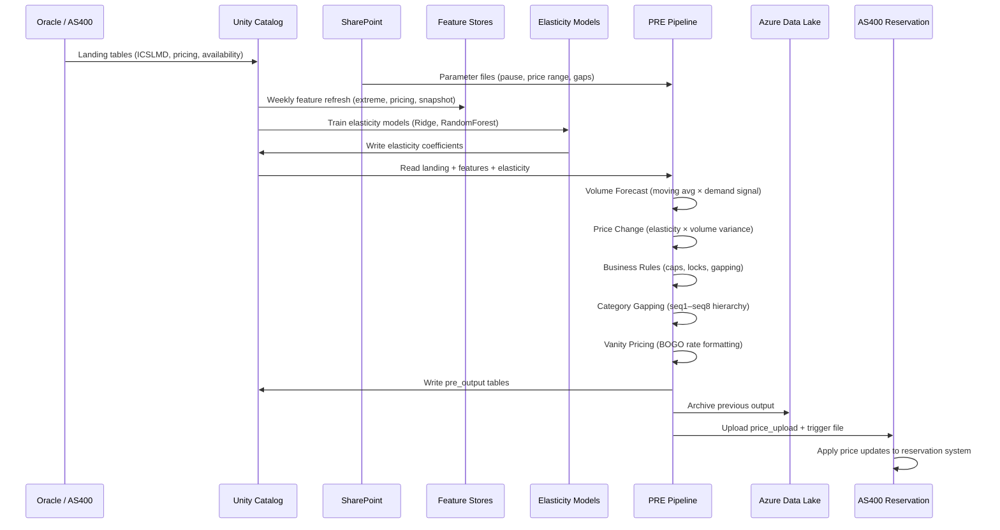

# OVERVIEW: PRE-dbricks

## 1. Project Overview

| Field | Detail |
|-------|--------|
| **Project Name** | PRE-dbricks (Price Recommendation Engine) |
| **Purpose** | Enterprise revenue management pricing optimization for Royal Caribbean Group cruises. Calculates weekly recommended cabin prices using elasticity models, volume forecasts, and business rules for RCI, Celebrity (CEL Lite), and Seabourn (SSC) brands. |
| **Tech Stack** | Databricks (Azure), PySpark, Python 3.10, Delta Lake, Unity Catalog, MLflow, scikit-learn, Azure Data Lake Storage (ADLS), SharePoint (Office365 REST API), Azure DevOps CI/CD |
| **Entry Points** | `PRE_Model/Final_Code/PRE_Pipeline2_MainRun.py` (RCI full), `PRE_Model/PRE_Lite/PRE_lite_main.py` (CEL Lite), `PRE_Model/PRE_SSC/main/main_nb_monday.py` (Seabourn), `Elasticity_Model/RCI_Elasticity_4.0/04_MASTER_DRIVER.ipynb` (model training) |
| **Deployment Targets** | **Dev**: `adb-3692873619125232.12` / **QA**: `adb-2056111555648428.8` / **Prod**: `adb-7486609540090573.13` |
| **Dependencies** | `pyspark`, `pandas`, `numpy`, `scikit-learn`, `statsmodels`, `mlflow`, `office365`, `openpyxl`, `scipy`, `category-encoders`, `interpret` |

---

## 2. Directory Structure

```
PRE-dbricks/
├── databricks.yml                          # Bundle config — 3 deployment targets
├── .gitignore
├── unity_catalog_data_cleanup.py           # One-time UC migration cleanup
│
├── ADF_View_Queries/                       # Azure Data Factory view migrations (159+ SQL files)
│   ├── 1_Original_Queries/                 # 159 Oracle source queries
│   ├── 2_In_Progress_human_in_the_loop/    # Manual review stage
│   ├── 3_In_progress_testing/              # 42 SQL files in testing
│   ├── 4_Queries_Migrated/                 # 13 completed UC migrations
│   ├── DE_table_ingestion_histoical_load.py
│   └── UCMigrationViewCreator.py           # Utility to create UC views from Oracle SQL
│
├── azure-pipelines/                        # CI/CD configuration
│   ├── ci-pipeline.yml
│   ├── project_config.yml
│   ├── rules_based_checks.json
│   ├── .flake8
│   └── genai_checks.md
│
├── Dev_DE_Notebooks/                       # Data engineering notebooks
│   ├── generic_nb/                         # Mounting & ship class utilities
│   │   ├── mount_parquet_from_param.py     # ADLS parquet mount helper
│   │   └── ship_class.py                   # Ship class definitions
│   ├── parameter_nb/                       # Revenue parameter definitions (13 files)
│   │   ├── revoreo_*.py                    # Parameter tables (pause, price range, etc.)
│   │   └── team_map.py                     # Team-to-product mapping
│   ├── pre_nb/                             # Pre-processing modules (18 files)
│   │   ├── category_mapping.py / currency_mapping.py
│   │   ├── revstrat_*.py                   # Revenue strategy transformations
│   │   └── mtrb_baskets.py                 # Basket definitions
│   └── testing/
│
├── Elasticity_Model/                       # Price elasticity modeling
│   ├── RCI_Elasticity_4.0/                 # Main RCI elasticity (7 notebooks)
│   │   ├── config_nb.py                    # Model configuration
│   │   ├── 04_MASTER_DRIVER.ipynb          # Entry point — training orchestrator
│   │   ├── helpers/                        # Utility notebooks
│   │   └── model_lib/                      # ML training & artifact classes
│   │       └── TrainModelClass.py          # Ridge + RandomForest training
│   ├── Elasticity_30/                      # Poisson regression models
│   ├── Europe/                             # European market elasticity (2 notebooks)
│   ├── 7N_Carib_NOC/                       # 7-night Caribbean (2 notebooks)
│   └── Short_Carib/                        # Short Caribbean
│
├── FeatureStores/                          # Databricks Feature Store
│   ├── fs_config_nb.py                     # Global feature store config
│   ├── fs_extreme_features/                # Weekly extreme value features
│   ├── fs_pricing_availability/            # Pricing & availability features
│   └── fs_snapshot_features/               # Weekly snapshot features
│
├── PRE_Model/                              # Main PRE implementations
│   ├── Final_Code/                         # Full RCI PRE
│   │   ├── PRE_Configuration.py            # Entry config for all notebooks
│   │   ├── PRE_Pipeline2_MainRun.py        # Primary orchestrator (entry point)
│   │   ├── PRE_pl3.py                      # Final output formatting
│   │   ├── Configuration/                  # Shared config modules
│   │   │   ├── DataFrame_ReaderAndWriter.py  # Spark↔Pandas bridge
│   │   │   ├── DataFrame_Schema.py         # Schema definitions & enforcement
│   │   │   ├── DataFrame_TableChecker.py   # Data validation functions
│   │   │   ├── PRE_Parameters.py           # Runtime parameters
│   │   │   └── SharePoint.py               # SharePoint integration
│   │   ├── Data_Preprocessing/             # Input data ETL
│   │   │   ├── Data_Reader_Refactor.py     # Main input reader
│   │   │   └── Parameter_Reader.py         # Parameter ingestion
│   │   ├── Data_Postprocessing/            # Output formatting
│   │   │   └── Output_Prices.py            # Vanity pricing (BOGO), exception codes
│   │   ├── Main_PRE/                       # Core pricing logic
│   │   │   ├── Volume_Forecast.py          # Moving avg + demand adjustment
│   │   │   ├── Business_Rules_Refactor.py  # Caps, booking position, currency
│   │   │   └── Final_Prices.py             # Category gapping (seq1–seq8)
│   │   └── RCI_Elasticity_4_0/             # RCI elasticity model (embedded)
│   │
│   ├── PRE_Common/                         # Price upload modules (3 files)
│   │   ├── PRE_pl3_rci_manual_price_upload.py
│   │   └── PRE_pl3_cel_manual_price_upload.py
│   │
│   ├── PRE_Lite/                           # Lightweight PRE for CEL
│   │   ├── PRE_lite_configuration.py
│   │   ├── PRE_lite_main.py                # Entry point
│   │   ├── Configuration/
│   │   ├── elasticity_model/
│   │   └── Main_PRE_Lite/
│   │       └── price_change_3_0.py         # Simplified price calculation
│   │
│   ├── PRE_Lite_framework/                 # Framework for PRE Lite flexibility
│   │   ├── CEL_ELASTICITY_4.0/
│   │   ├── Configuration/
│   │   ├── Elasticity_Model/
│   │   └── Main_Pre_Lite/
│   │
│   └── PRE_SSC/                            # Seabourn Cruise Line PRE
│       ├── config_nb.py / config/
│       ├── input_queries/ (9 SQL files)
│       └── main/ (4 Python files)
│
├── Utils/                                  # Utility modules
│   ├── landing-tables_mounting_PRE.py      # ADLS mounting
│   ├── landing-tables_mounting_RAWTABLES.py
│   └── sharepoint_data_processing.py       # SharePoint Excel import
│
└── resources/                              # Databricks job definitions (6 YAML)
    ├── cel_pre_manual_price_upload.yml
    ├── common_pre_combined_price_upload.yml
    ├── rci_pre_manual_price_upload.yml
    ├── rci_pre_price_upload_AUS.yml
    ├── ssc_pre_monday.yml
    └── ssc_pre_upload.yml
```

---

## 3. File-by-File Breakdown

### Configuration & Entry Points

| Field | `PRE_Pipeline2_MainRun.py` |
|---|---|
| **Purpose** | **Primary orchestrator** for full RCI PRE pipeline. Validates landing data, runs elasticity modeling, refreshes feature stores, calculates volume forecasts, computes price changes, applies business rules, and generates final hierarchical prices. |
| **Inputs** | Landing tables (ICSLMD_COMPANION, META_PRODUCTS, v_df_CATEGORIES, v_LIVE_PRICING), demand forecasts, track data, parameter tables, elasticity models |
| **Outputs** | `pre_rci_intermed.*` intermediate tables, final pricing passed to PRE_pl3 |
| **Dependencies** | PRE_Configuration, all Configuration/*, Data_Preprocessing/*, Main_PRE/*, FeatureStores |

| Field | `PRE_pl3.py` |
|---|---|
| **Purpose** | Final output stage. Runs `Final_Prices.py` (category gapping) and `Output_Prices.py` (vanity pricing), writes to `pre_rci_output.pre_output_nonaus`, archives previous output. |
| **Inputs** | Intermediate pricing tables from Pipeline2 |
| **Outputs** | `{env}_revenue_mgmt_bu.pre_rci_output.pre_output_nonaus`, `pre_output_bk` (archive) |

| Field | `PRE_lite_main.py` |
|---|---|
| **Purpose** | **Entry point** for CEL Lite — lightweight pricing for Celebrity Cruises. Simplified pipeline: SharePoint parameters → data reader → volume forecast → price change 3.0 → business rules → output. |
| **Inputs** | SharePoint parameter files, landing tables (CEL filtered), elasticity input |
| **Outputs** | `{env}_revenue_mgmt_bu.pre_lite.pre_output` |

| Field | `main_nb_monday.py` (PRE_SSC) |
|---|---|
| **Purpose** | **Entry point** for Seabourn weekly pricing. SSC-specific rule engine with custom SQL input queries. |
| **Inputs** | 9 SQL input queries in `input_queries/`, SSC-specific parameters |
| **Outputs** | `{env}_revenue_mgmt_bu.pre_ssc.pre_output` |

### Core Pricing Logic (Main_PRE/)

| Field | `Volume_Forecast.py` |
|---|---|
| **Purpose** | Calculates 6-week volume forecasts using moving averages of historical occupancy adjusted by demand forecast signals. |
| **Inputs** | `fit_track_pax_build` (historical booking curves), `demand_forecast` |
| **Outputs** | `forecasted_volume` per ship/sailing/category |
| **Algorithm** | `forecasted_volume = historical_moving_avg(3W or 6W) × demand_signal / historical_avg_demand` |

| Field | `Business_Rules_Refactor.py` |
|---|---|
| **Purpose** | Applies business constraints after elasticity calculation: price caps (min/max), booking position locks (no decreases at high occupancy), currency gapping, inversion gap fixes, refundable premium logic. |
| **Inputs** | Uncapped price changes, parameter tables (PRICE_RANGE, BOOKED_POSITION, INVERSION_GAPS, PAUSE) |
| **Outputs** | `capped_price_recommendation` per CCO (category/currency/occupancy) |

| Field | `Final_Prices.py` |
|---|---|
| **Purpose** | Applies category hierarchy gapping using sequence-based pricing (seq1–seq8). Open category gets lead price; lower-sequence categories get progressively marked-up prices. |
| **Inputs** | Capped price changes, category gap parameters |
| **Outputs** | `final_prices` at category level |

| Field | `Output_Prices.py` |
|---|---|
| **Purpose** | Applies standard/discount markup, calculates vanity pricing (BOGO rate), identifies exception conditions (error codes 3.1.0–3.2.2), formats for AS400 reservation system. |
| **Inputs** | Final prices, refund premium settings |
| **Outputs** | `pre_output` table (WKSHIP, WKSDDT, WKPKID, etc.), exception codes |
| **Exception Codes** | 3.1.1 (price direction mismatch), 3.2.1 (>$400 change) |

### Data Infrastructure

| Field | `DataFrame_Schema.py` |
|---|---|
| **Purpose** | Centralized schema definitions for all tables. Provides type enforcement for both Spark and pandas DataFrames. |
| **Key Functions** | Schema dicts for all tables, `enforce_spark_schema()` |

| Field | `DataFrame_ReaderAndWriter.py` |
|---|---|
| **Purpose** | Bridge between Spark and pandas DataFrames. Handles reading from/writing to Databricks tables, ADLS parquet, and Delta. |
| **Key Functions** | `read_databricks_dataframe()`, `write_databricks_tbl()` |

| Field | `Data_Reader_Refactor.py` |
|---|---|
| **Purpose** | Main input data reader. Loads booking, pricing, and track data via SQL joins from Unity Catalog landing tables. |
| **Inputs** | `prd_silver.mkrpuser.*`, `prd_silver.pricing.*`, `pre.revstrat_*` |

### Elasticity Modeling

| Field | `TrainModelClass.py` |
|---|---|
| **Purpose** | ML training class for price elasticity models. Trains Ridge and RandomForest regressors per meta-product/category-class/sail-month segment. Logs to MLflow. |
| **Inputs** | Feature store tables, pricing/demand history |
| **Outputs** | `elasticity_table` (ship × date × category × elasticity coefficient) |
| **Models** | Ridge regression, RandomForest |

| Field | `04_MASTER_DRIVER.ipynb` |
|---|---|
| **Purpose** | **Entry point** for RCI elasticity model training. Orchestrates feature engineering → model training → elasticity output. |
| **Outputs** | `elasticity.elasticity` table |

### Feature Stores

| Field | `fs_config_nb.py` |
|---|---|
| **Purpose** | Global Feature Store configuration — catalog, schema, table naming conventions. |

| Field | Feature store notebooks (`fs_extreme_features/`, `fs_pricing_availability/`, `fs_snapshot_features/`) |
|---|---|
| **Purpose** | Weekly feature computation. Extreme features: max/min occupancy, velocity, volatility. Pricing features: current prices, availability, booking curves. Snapshot features: weekly state capture. |
| **Outputs** | `fs_ship_sdt_catclass_weekly_extreme`, `fs_ship_sdt_catclass_weekly_pricing_availability`, `fs_ship_sdt_catclass_weekly_snapshot` |

### SQL Migration (ADF_View_Queries/)

| Field | `UCMigrationViewCreator.py` |
|---|---|
| **Purpose** | Utility to convert Oracle ADF SQL queries into Unity Catalog views. Migration from legacy Oracle-based views. |
| **Progress** | 13 of 159 queries migrated (~8%) |

---

## 4. File Relationship Map

```mermaid
flowchart TD
    subgraph CONFIG["Configuration Layer"]
        PRE_CFG["PRE_Configuration.py"]
        PARAMS["PRE_Parameters.py"]
        SCHEMA["DataFrame_Schema.py"]
        RW["DataFrame_ReaderAndWriter.py"]
        CHECKER["DataFrame_TableChecker.py"]
        SP["SharePoint.py"]
    end

    subgraph PREPROCESSING["Data Preprocessing"]
        DATA_READ["Data_Reader_Refactor.py"]
        PARAM_READ["Parameter_Reader.py"]
    end

    subgraph FEATURE_STORES["Feature Stores"]
        FS_CFG["fs_config_nb.py"]
        FS_EXTREME["fs_extreme_features"]
        FS_PRICING["fs_pricing_availability"]
        FS_SNAP["fs_snapshot_features"]
    end

    subgraph ELASTICITY["Elasticity Modeling"]
        MASTER["04_MASTER_DRIVER.ipynb"]
        TRAIN["TrainModelClass.py"]
        HELPERS["helpers/"]
    end

    subgraph MAIN_PRE["Core Pricing Logic"]
        VOL["Volume_Forecast.py"]
        PRICE_CHG["price_change_3_0.py"]
        BIZ_RULES["Business_Rules_Refactor.py"]
        FINAL_PR["Final_Prices.py"]
        OUTPUT_PR["Output_Prices.py"]
    end

    subgraph ENTRY["Pipeline Entry Points"]
        PIPE2["PRE_Pipeline2_MainRun.py<br/>(RCI Full)"]
        PL3["PRE_pl3.py<br/>(RCI Output)"]
        LITE["PRE_lite_main.py<br/>(CEL Lite)"]
        SSC["main_nb_monday.py<br/>(Seabourn)"]
    end

    subgraph UPLOAD["Upload & Delivery"]
        RCI_UP["PRE_pl3_rci_manual<br/>_price_upload.py"]
        CEL_UP["PRE_pl3_cel_manual<br/>_price_upload.py"]
    end

    subgraph EXTERNAL["External Systems"]
        UC[("Unity Catalog<br/>(Landing Tables)")]
        SHAREPOINT[("SharePoint<br/>(Parameters)")]
        ADLS[("Azure Data Lake")]
        AS400[("AS400 Reservation<br/>System")]
        MLFLOW[("MLflow<br/>Model Registry")]
    end

    %% Config dependencies
    PIPE2 -->|imports| PRE_CFG
    PRE_CFG -->|imports| SCHEMA
    PRE_CFG -->|imports| RW
    PRE_CFG -->|imports| CHECKER
    PRE_CFG -->|imports| PARAMS

    %% Preprocessing
    PIPE2 -->|runs| DATA_READ
    PIPE2 -->|runs| PARAM_READ
    DATA_READ -->|uses| RW
    DATA_READ -->|uses| SCHEMA
    PARAM_READ -->|reads| SP

    %% Feature stores
    PIPE2 -->|refreshes| FS_EXTREME
    PIPE2 -->|refreshes| FS_PRICING
    PIPE2 -->|refreshes| FS_SNAP
    FS_EXTREME -->|uses| FS_CFG
    FS_PRICING -->|uses| FS_CFG
    FS_SNAP -->|uses| FS_CFG

    %% Elasticity
    PIPE2 -->|triggers| MASTER
    MASTER -->|uses| TRAIN
    MASTER -->|uses| HELPERS
    TRAIN -->|logs| MLFLOW

    %% Core pricing
    PIPE2 -->|runs| VOL
    PIPE2 -->|runs| PRICE_CHG
    PIPE2 -->|runs| BIZ_RULES
    VOL -->|output to| PRICE_CHG
    PRICE_CHG -->|output to| BIZ_RULES
    BIZ_RULES -->|output to| FINAL_PR
    FINAL_PR -->|output to| OUTPUT_PR

    %% Output
    PIPE2 -->|output to| PL3
    PL3 -->|runs| FINAL_PR
    PL3 -->|runs| OUTPUT_PR
    PL3 -->|output to| RCI_UP
    LITE -->|runs| PRICE_CHG
    LITE -->|runs| BIZ_RULES
    LITE -->|output to| CEL_UP

    %% External
    UC -->|reads| DATA_READ
    UC -->|reads| PARAM_READ
    SHAREPOINT -->|parameters| PARAM_READ
    SHAREPOINT -->|parameters| LITE
    FS_EXTREME -->|reads/writes| UC
    FS_PRICING -->|reads/writes| UC
    MASTER -->|reads| UC

    RCI_UP -->|writes| AS400
    CEL_UP -->|writes| AS400
    PL3 -->|archives| ADLS
    SSC -->|writes| AS400

    style CONFIG fill:#e8f4fd,stroke:#004ecc
    style MAIN_PRE fill:#e6faf4,stroke:#10a4b7
    style ELASTICITY fill:#fff3e0,stroke:#e65100
    style FEATURE_STORES fill:#f3e5f5,stroke:#6a1b9a
    style ENTRY fill:#e8f5e9,stroke:#2e7d32
    style EXTERNAL fill:#f5f5f5,stroke:#616161
```



---

## 5. Data Flow

### End-to-End Pricing Pipeline

1. **Landing Data**: Oracle reservation system → Unity Catalog (`prd_silver.mkrpuser.*`, `prd_silver.pricing.*`)
2. **Parameters**: SharePoint Excel files + Unity Catalog parameter tables (`parameter_db.revoreo_*`)
3. **Feature Stores**: Weekly refresh of pricing/demand feature tables
4. **Elasticity**: Train Ridge/RandomForest models per segment → `elasticity.elasticity` table
5. **Volume Forecast**: 3–6 week moving average × demand signal → `forecasted_volume`
6. **Price Change**: `elasticity × volume_variance` → `uncapped_price_change_pct`
7. **Business Rules**: Apply caps, booking position locks, currency gapping, inversion fixes
8. **Category Gapping**: Sequence-based hierarchy (seq1–seq8) ensures consistent markup
9. **Vanity Pricing**: BOGO rate (70%) → round to marketing-friendly numbers
10. **Upload**: Write to `res_upload.price_upload` → trigger file → AS400 applies prices

### Core Pricing Formula

```
uncapped_price_change_pct = elasticity × volume_variance
where:
  volume_variance = (forecasted_volume - historical_avg) / historical_avg
  elasticity = regression coefficient from Ridge/RandomForest model
```



---

## 6. Configuration & Environment

### Environment Variables

| Variable | Required | Description |
|---|---|---|
| `catalog_env` | **Yes** | `dev`, `qa`, or `prd` — determines all schema prefixes |

### Computed Schemas

| Schema Pattern | Purpose |
|---|---|
| `{env}_silver.mkrpuser.*` | Source landing tables (read) |
| `{env}_silver.pricing.*` | Pricing catalog (read) |
| `{env}_revenue_mgmt_bu.pre_rci_input` | PRE input staging (read) |
| `{env}_revenue_mgmt_bu.pre_rci_intermed.*` | Processing intermediates (read/write) |
| `{env}_revenue_mgmt_bu.pre_rci_output.*` | Final RCI pricing output (write) |
| `{env}_revenue_mgmt_bu.pre_lite.*` | CEL Lite output (write) |
| `{env}_revenue_mgmt_bu.pre_ssc.*` | Seabourn output (write) |
| `{env}_revenue_mgmt_bu.feature_stores.*` | Feature store tables (read/write) |
| `{env}_bronze.res_upload.price_upload` | Staging for AS400 upload (write) |
| `parameter_db.revoreo_*` | Pricing parameters (read) |
| `elasticity_de.*` / `elasticity.elasticity` | Elasticity model outputs (read/write) |

### Databricks Deployment Targets

| Target | Workspace | Status | Service Principal |
|---|---|---|---|
| dev | `adb-3692873619125232.12` | PAUSED | User deployment |
| qa | `adb-2056111555648428.8` | PAUSED | `0f53cdff-3afd-429b-87d5-281294002a83` |
| prd | `adb-7486609540090573.13` | UNPAUSED | `d020c2b4-0ef8-4db9-94f7-cd2fde91db39` |

### Key Config Files

| File | Description |
|---|---|
| `databricks.yml` | Bundle config — 3 targets with warehouse IDs, service principals |
| `resources/*.yml` (6 files) | Databricks Job definitions for RCI, CEL, SSC price uploads |
| `azure-pipelines/ci-pipeline.yml` | PR checks (flake8, GenAI checks) |
| SharePoint parameter files | Runtime pricing rules (pause, price range, category gaps, etc.) |
| `Dev_DE_Notebooks/parameter_nb/revoreo_*.py` | Parameter table definitions |
