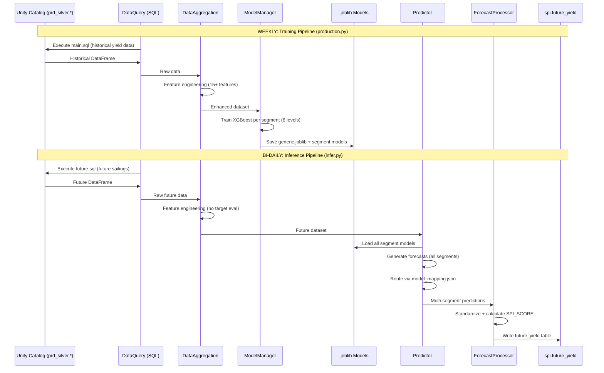

# OVERVIEW: SPI-dbricks

## 1. Project Overview

| Field | Detail |
|-------|--------|
| **Project Name** | SPI-dbricks (Sailing Performance Index) |
| **Purpose** | ML-driven yield forecasting for Royal Caribbean Group cruises. Trains XGBoost/LightGBM regression models segmented by brand, region, port, ship class, and individual ship to predict NTR yield (net ticket revenue per passenger-day) for future sailings. Produces an SPI score (actual/predicted ratio) used by revenue management. |
| **Tech Stack** | Databricks (Azure), PySpark, Python 3.x, XGBoost, LightGBM, scikit-learn, SHAP, MLflow, Joblib, Plotly, Streamlit, Delta Lake, Unity Catalog |
| **Entry Points** | `scoring/production.py` (weekly model training), `scoring/infer.py` (bi-daily inference), `factor/model.py` (local dev training) |
| **Deployment Targets** | **Dev**: `adb-3692873619125232.12` / **QA**: `adb-2056111555648428.8` / **Prod**: `adb-7486609540090573.13` |
| **Dependencies** | `xgboost`, `lightgbm`, `scikit-learn`, `category-encoders`, `shap`, `pandas`, `numpy`, `plotly`, `streamlit`, `pyspark`, `geopy`, `holidays`, `scipy`, `joblib`, `pyyaml` |

---

## 2. Directory Structure

```
SPI-dbricks/
├── databricks.yml                          # Bundle config — 3 deployment targets
├── .gitignore
│
├── factor/                                 # Development/research environment
│   ├── config.yaml                         # Feature list, target, random_state
│   ├── model_mapping.json                  # Ship → forecast model routing
│   ├── model.py                            # Core ML pipeline (train, backtest)
│   ├── preprocessing.py                    # DataAggregation: load, merge, feature eng
│   ├── data_query.py                       # SparkBase + DataQuery: SQL execution
│   ├── data_translate.py                   # ForecastProcessor: standardize predictions
│   ├── data_push.py                        # Push DataFrames to Spark tables
│   ├── display.py                          # SPIAnalyzer: load & filter results
│   ├── time_intervals.py                   # Vectorized interval metric extraction
│   ├── room_type.py                        # Streamlit dashboard for T4 analysis
│   ├── build_display.py / build_display_old.py / build_display_older.py
│   ├── build_eda.py / curve_cluster.py / deploy_length.py
│   ├── factor_wip.py / grouped_cat.py / combined_group.py / convert_build.py
│   ├── predictions.csv / room_type.csv / scores_updated.csv
│   ├── data/                               # CSV datasets for local development
│   ├── eda/                                # Exploratory data analysis scripts
│   ├── helpers/                            # Shared utility package
│   │   ├── __init__.py
│   │   ├── generic.py                      # Config loading, DataFrame merge, backtesting
│   │   ├── transformers.py                 # Custom sklearn transformers (8 classes)
│   │   ├── temporal.py                     # Sinusoidal date encoding, seasonality
│   │   ├── metrics.py                      # MAE, RMSE, Pearson, Spearman, R²
│   │   ├── plotting.py                     # Quantile fan charts (Plotly)
│   │   ├── quantile.py                     # AlignedQuantileLGBM (P10–P90)
│   │   ├── holiday_check.py               # Multi-country holiday detection
│   │   ├── weather.py                      # Open-Meteo weather API
│   │   ├── shap_eval.py                    # SHAP feature importance analysis
│   │   ├── cache.py                        # Caching utilities
│   │   ├── data_push.py                    # Push data to Spark tables
│   │   ├── data_query.py                   # SQL query helpers
│   │   └── model_save.py                   # Model serialization
│   ├── models/actual_build/                # Trained .pkl model files per ship
│   └── query/                              # SQL extraction files
│       ├── build.sql                       # Tracking build pct at 10-week intervals
│       ├── group.sql                       # Group vs FIT booking distribution
│       ├── deployment_length.sql           # Gap days between deployments
│       ├── discount.sql / gty.sql / room_type.sql
│       ├── sailing_class.sql / t4_pct.sql / track.sql / international.sql
│
├── scoring/                                # Production inference environment
│   ├── config.yaml                         # Same feature/target config
│   ├── model_mapping.json                  # Ship → model segment routing
│   ├── production.py                       # Main training pipeline (entry point)
│   ├── infer.py                            # Inference pipeline (entry point)
│   ├── inference.py                        # Predictor class: multi-segment forecasts
│   ├── model_manager.py                    # ModelManager: train per-segment models
│   ├── model.py                            # ML pipeline class (same as factor)
│   ├── preprocessing.py                    # DataAggregation (same as factor)
│   ├── cabin_translate.py                  # Cabin category translation
│   ├── data_push.py / data_query.py / data_translate.py / display.py
│   ├── room_type_eda.py                    # Room type EDA
│   ├── scores.csv
│   ├── archive/prior_model/                # Legacy CEL models
│   ├── documentation/Model_Diagram.drawio  # Architecture diagram
│   ├── helpers/                            # Same helpers package
│   ├── models/                             # Trained .joblib production models
│   │   ├── generic.joblib                  # Global fallback model
│   │   ├── BRAND/ (C.joblib, R.joblib)
│   │   ├── ORIGINATING_PORT/ (16 port .joblib files)
│   │   ├── REGION/ (11 region .joblib files)
│   │   ├── SHIP_CLASS/ (10 class .joblib files)
│   │   └── SHIP_CODE/ (30 ship .joblib files)
│   ├── results/                            # Output prediction files
│   └── query/
│       ├── main.sql                        # Core yield data (historical)
│       └── future.sql                      # Future sailing data (inference)
│
└── resources/                              # Databricks job definitions
    ├── SPI_Production.yml                  # Weekly model training job
    └── SPI_Infer.yml                       # Bi-daily inference job
```

---

## 3. File-by-File Breakdown

### Core ML Pipeline

| Field | `model.py` (factor/ and scoring/) |
|---|---|
| **Purpose** | Core ML pipeline class. Builds a scikit-learn Pipeline with custom transformers + XGBoost/LightGBM regressor. Supports training, prediction, backtesting (rolling window with daily retraining). |
| **Inputs** | DataFrame with features + target column, date range for train/test split |
| **Outputs** | Trained pipeline, predictions DataFrame, backtest results |
| **Key Functions** | `build_pipeline()` — constructs sklearn Pipeline; `build_train_test()` — temporal split; `backtest()` — rolling forward-test |
| **Dependencies** | `preprocessing.DataAggregation`, `helpers.transformers.*`, `helpers.temporal.*`, `helpers.metrics.*`, `helpers.quantile.AlignedQuantileLGBM` |

| Field | `preprocessing.py` |
|---|---|
| **Purpose** | `DataAggregation` class: loads historical data from SQL, merges cancellation data, calculates 15+ derived features (weekend flags, nights_changed, dates_in_service, scaled yield metrics). |
| **Inputs** | SQL queries via `DataQuery`, cancellation CSV |
| **Outputs** | Enhanced DataFrame with features ready for modeling |
| **Key Functions** | `build()` — full data pipeline; `target_eval()` — scaled APD/yield with YoY normalization; `modify()` — add derived features |
| **Dependencies** | `data_query.DataQuery` |

| Field | `data_query.py` |
|---|---|
| **Purpose** | `SparkBase` + `DataQuery` classes: unified SQL execution interface for Databricks (Spark.sql) or local development (SQL Warehouse connector via `databricks-sql-connector`). Dynamically creates methods from SQL files. |
| **Inputs** | SQL files in `query/` folder |
| **Outputs** | Pandas/PySpark DataFrames |
| **Key Functions** | `_load_sql_methods()` — creates methods from .sql files; `sql()` — unified query interface |

### Production & Inference

| Field | `production.py` |
|---|---|
| **Purpose** | **Entry point** for weekly production training. Loads historical data, trains segment-specific models (6 levels: global, brand, region, port, class, ship), saves .joblib files, generates backtest results. |
| **Inputs** | `config.yaml`, historical data from `prd_silver.*` tables |
| **Outputs** | `.joblib` model files in `models/{SEGMENT}/`, backtest results |
| **Schedule** | Weekly (Databricks job `SPI_Production`) |

| Field | `infer.py` |
|---|---|
| **Purpose** | **Entry point** for bi-daily inference. Applies trained models to future sailing dates, selects best model per ship via `model_mapping.json`, writes forecasts to Unity Catalog. |
| **Inputs** | Future sailing data from `future.sql`, trained `.joblib` models |
| **Outputs** | `{catalog_env}_revenue_mgmt_bu.spi.future_yield` table |
| **Schedule** | Every 2 days (Databricks job `SPI_Infer`) |

| Field | `inference.py` |
|---|---|
| **Purpose** | `Predictor` class: loads all segment models, generates forecasts at each level, selects best via config-based routing. |
| **Inputs** | `future_dataset`, `model_base_path`, `model_mapping.json` |
| **Outputs** | DataFrame with FORECAST column (selected best model per ship) |

| Field | `model_manager.py` |
|---|---|
| **Purpose** | `ModelManager`: trains XGBoost models segmented by feature value (e.g., per REGION, per PORT). Saves each as `.joblib`. |
| **Key Functions** | `train_subset_models()` — train/save models per segment |

### Helpers Package

| Field | `helpers/transformers.py` |
|---|---|
| **Purpose** | 8 custom scikit-learn compatible transformers for feature engineering. |
| **Key Classes** | `ColumnSelector`, `SimplePCA`, `HybridFeatureImportance`, `ObjectToDiscreteEncoder`, `DistributionalTargetEncoderNew`, `TravelSpendingTransformer`, `SailingRegionDistanceTransformer`, `SailingDateYearsTransformer` |

| Field | `helpers/quantile.py` |
|---|---|
| **Purpose** | `AlignedQuantileLGBM`: produces P10–P90 prediction intervals aligned to the P50 point estimate. |

| Field | `helpers/holiday_check.py` |
|---|---|
| **Purpose** | `RegionalHolidayChecker`: detects holidays across multiple countries/regions for cruise itineraries. |

| Field | `helpers/weather.py` |
|---|---|
| **Purpose** | `CruiseWeatherAPI`: fetches historical weather data from Open-Meteo API for cruise port locations. |

| Field | `helpers/shap_eval.py` |
|---|---|
| **Purpose** | SHAP-based model explainability: feature importance rankings and collinearity analysis. |

### SQL Queries

| File | Purpose |
|---|---|
| `query/main.sql` | Core historical yield data joining voyages, bookings, NTR metrics from `prd_silver.*` |
| `query/future.sql` | Future sailing data (same schema, future dates only) |
| `query/build.sql` | Tracking build pct at 10-week intervals from `dyn_track_mkt_hist_cc` |
| `query/group.sql` | Group vs FIT booking distribution from `vcap_daily_extreme` |

---

## 4. File Relationship Map

```mermaid
flowchart TD
    subgraph HELPERS["helpers/ — Shared Utilities"]
        GENERIC["generic.py<br/>Config, merge, backtest"]
        TRANSFORMERS["transformers.py<br/>8 sklearn transformers"]
        TEMPORAL["temporal.py<br/>Sinusoidal encoding"]
        METRICS["metrics.py<br/>MAE, RMSE, R²"]
        QUANTILE["quantile.py<br/>AlignedQuantileLGBM"]
        HOLIDAY["holiday_check.py<br/>Regional holidays"]
        WEATHER["weather.py<br/>Open-Meteo API"]
        SHAP_E["shap_eval.py<br/>SHAP importance"]
        DP["data_push.py"]
    end

    subgraph CORE["Core ML Pipeline"]
        MODEL["model.py<br/>Pipeline, train, backtest"]
        PREPROC["preprocessing.py<br/>DataAggregation"]
        DQ["data_query.py<br/>SparkBase + DataQuery"]
    end

    subgraph PRODUCTION["Production (scoring/)"]
        PROD["production.py<br/>(Weekly Training)"]
        INFER["infer.py<br/>(Bi-daily Inference)"]
        INFERENCE["inference.py<br/>Predictor class"]
        MM["model_manager.py<br/>Segment training"]
        DT["data_translate.py<br/>ForecastProcessor"]
    end

    subgraph MODELS["Trained Models"]
        GLOBAL["generic.joblib"]
        BRAND_M["BRAND/*.joblib"]
        REGION_M["REGION/*.joblib"]
        PORT_M["ORIGINATING_PORT/*.joblib"]
        CLASS_M["SHIP_CLASS/*.joblib"]
        SHIP_M["SHIP_CODE/*.joblib"]
    end

    subgraph CONFIG["Configuration"]
        CFG_YAML["config.yaml"]
        MAP_JSON["model_mapping.json"]
    end

    subgraph EXTERNAL["External Systems"]
        UC[("Unity Catalog<br/>prd_silver.*")]
        SQL_FILES["query/*.sql"]
        OUTPUT[("spi.future_yield<br/>table")]
    end

    %% Core flow
    DQ -->|reads| SQL_FILES
    SQL_FILES -->|queries| UC
    PREPROC -->|uses| DQ
    MODEL -->|uses| PREPROC
    MODEL -->|uses| TRANSFORMERS
    MODEL -->|uses| TEMPORAL
    MODEL -->|uses| METRICS
    MODEL -->|uses| QUANTILE
    MODEL -->|uses| GENERIC

    %% Production training
    PROD -->|uses| PREPROC
    PROD -->|uses| MM
    MM -->|uses| MODEL
    MM -->|saves| GLOBAL
    MM -->|saves| BRAND_M
    MM -->|saves| REGION_M
    MM -->|saves| PORT_M
    MM -->|saves| CLASS_M
    MM -->|saves| SHIP_M
    PROD -->|reads| CFG_YAML

    %% Inference
    INFER -->|uses| PREPROC
    INFER -->|uses| INFERENCE
    INFERENCE -->|loads| GLOBAL
    INFERENCE -->|loads| BRAND_M
    INFERENCE -->|loads| REGION_M
    INFERENCE -->|loads| PORT_M
    INFERENCE -->|loads| CLASS_M
    INFERENCE -->|loads| SHIP_M
    INFERENCE -->|routes via| MAP_JSON
    INFER -->|uses| DT
    INFER -->|uses| DP
    DP -->|writes| OUTPUT

    %% External
    UC -->|data| DQ

    style HELPERS fill:#f3e5f5,stroke:#6a1b9a
    style CORE fill:#e8f4fd,stroke:#004ecc
    style PRODUCTION fill:#e6faf4,stroke:#10a4b7
    style MODELS fill:#fff3e0,stroke:#e65100
    style CONFIG fill:#f5f5f5,stroke:#616161
    style EXTERNAL fill:#e8f5e9,stroke:#2e7d32
```



---

## 5. Data Flow

### End-to-End Pipeline

1. **Source Data**: `prd_silver.*` tables (yield, bookings, capacity, itineraries, products) queried via SQL files
2. **Feature Engineering**: `DataAggregation` builds 15+ features (weekend flags, dates_in_service, scaled yield, seasonality)
3. **Model Training** (weekly): `ModelManager` trains XGBoost models at 6 segmentation levels → `.joblib` files
4. **Inference** (bi-daily): `Predictor` loads models, generates forecasts per segment, selects best via `model_mapping.json`
5. **Output**: Standardized forecasts with SPI_SCORE written to `{env}_revenue_mgmt_bu.spi.future_yield`

### Model Segmentation (6 Levels)

| Level | Models | Fallback |
|---|---|---|
| Generic (global) | 1 model | Default for 28/42 ships |
| Brand | 2 (RCI, CEL) | 4 ships |
| Region | 11 (AK, AUS, BAH, ...) | 3 ships |
| Originating Port | 16 (MIA, BCN, BAO, ...) | 3 ships |
| Ship Class | 10 (EDGE, FREEDOM, OASIS, ...) | 4 ships |
| Ship Code | 30 individual | Not used in production |



---

## 6. Configuration & Environment

### Environment Variables

| Variable | Required | Description |
|---|---|---|
| `catalog_env` | **Yes** | `dev`, `qa`, or `prd` — schema prefix |
| `DATABRICKS_HOST` | Local only | SQL Warehouse host for local dev |
| `DATABRICKS_HTTP_PATH` | Local only | SQL Warehouse path |
| `DATABRICKS_TOKEN` | Local only | PAT for local dev |

### Config Files

| File | Description |
|---|---|
| `config.yaml` | Feature list (15 features), target (`CORP_NTR_YIELD`), load column, APD column, random_state |
| `model_mapping.json` | Ship-code → forecast-model routing (which segment model per ship) |
| `databricks.yml` | Bundle deployment — 3 targets with warehouse IDs, service principals |
| `resources/SPI_Production.yml` | Weekly training job (cluster: 2–4 workers, Standard_D3_v2) |
| `resources/SPI_Infer.yml` | Bi-daily inference job |

### Database Tables

| Table | Direction | Description |
|---|---|---|
| `prd_silver.mkrp_rmd_secure.dyn_track_mkt_hist_cc` | Read | Marketing tracking (pax by week) |
| `prd_silver.mkrp_rmd.vcap_daily_extreme` | Read | Booking data (Group/FIT) |
| `prd_silver.mkrp_rmd_secure.new_rcd_bkc_mkt` | Read | Revenue data (NTR, PCD, FX) |
| `prd_silver.mkrpuser.ICSLMD_COMPANION` | Read | Sailing master metadata |
| `prd_silver.edw_core.v_dim_voyage_itinerary_day` | Read | Voyage itinerary details |
| `{env}_revenue_mgmt_bu.spi.future_yield` | Write | Production forecasts |
| `{env}_revenue_mgmt_bu.spi_new.scores_updated` | Write | Backtest results |
