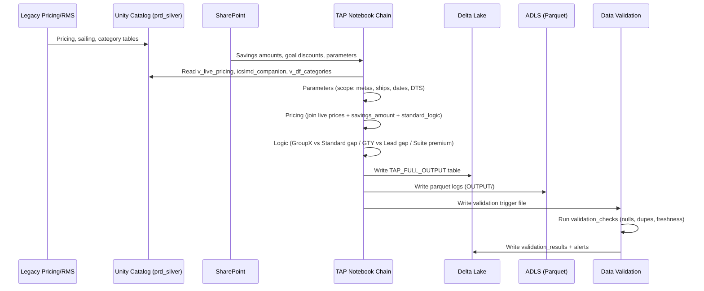

# OVERVIEW: TAP-CEL-dbricks

## 1. Project Overview

| Field | Detail |
|-------|--------|
| **Project Name** | TAP-CEL-dbricks (Targeted Availability Pricing — Celebrity Cruises) |
| **Purpose** | Automated dynamic pricing and inventory optimization for Celebrity Cruises. Implements Targeted Availability Pricing (TAP) across 14+ product segments (Groups, Suites, Singles, Alaska, River, CruiseTours, Galápagos, Perks, GTY/Lead optimization, etc.). Calculates goal prices relative to live pricing, applies business rules, and handles event-driven pricing updates. |
| **Tech Stack** | Databricks (Azure), PySpark, Python 3.x, Delta Lake, Unity Catalog, scikit-learn (LogisticRegression for GTY-Lead models), MLflow, MSAL (SharePoint/Graph API), ADLS, Azure DevOps CI/CD |
| **Entry Points** | Each TAP product has its own Main notebook: `TAP_GROUPS/Groups TAP Main.py`, `TAP_SUITES/Main/SuitesMain.py`, `TAP_ALASKA/Alaska_Logic.ipynb`, `TAP_GTY_LEAD/GTY-Lead Main.py`, etc. All orchestrated via 18 Databricks workflow YAMLs in `resources/`. |
| **Deployment Targets** | **Dev**: `adb-3692873619125232.12` / **QA**: `adb-2056111555648428.8` / **Prod**: `adb-7486609540090573.13` |
| **Dependencies** | `pyspark`, `pandas`, `numpy`, `scikit-learn`, `category-encoders`, `mlflow`, `statsmodels`, `msal`, `requests`, `openpyxl`, `scipy` |

---

## 2. Directory Structure

```
TAP-CEL-dbricks/
├── databricks.yml                          # Bundle config — 3 deployment targets
├── .gitignore
│
├── Configuration/                          # Shared utility modules
│   ├── landing-tables_mounting_TAP.py      # ADLS → Delta table mounting
│   ├── Pricing_Functions.py               # Core pricing (bundled, BOGO, currency)
│   └── SharePointSavings.py               # MS Graph API SharePoint integration
│
├── azure-pipelines/                        # CI/CD (flake8, GenAI checks)
│
├── TAP_GROUPS/                             # Group booking optimization (7 files)
│   ├── Groups TAP Main.py                  # Entry point (Wed/Sat 11:50 PM)
│   ├── SharePoint.py / Parameters.py / Pricing.py
│   ├── Groups_Tap_Logic.py                 # GroupX vs Standard gap pricing
│   ├── Output_Logging.py
│   └── GroupTargetSharePointCreation.py
│
├── TAP_SUITES/                             # Suite premium pricing (20+ files)
│   ├── Main/SuitesMain.py                  # Entry point
│   │   ├── Logic/ (CabinChanges, FinalPrices, Logic, MaxBKPOS, PriceChanges, ValidateChanges)
│   │   ├── Lowering/                       # Price floor logic
│   │   └── Spare/                          # Backup logic
│   ├── Event Driven/                       # Event-triggered suite updates
│   ├── InventoryLog/                       # Inventory tracking
│   └── Revert/                             # Price rollback
│
├── TAP_GTY_LEAD/                           # GTY vs Lead optimization (13 files)
│   ├── GTY-Lead Main.py                    # Entry point
│   ├── GTY_Lead_Logic.py                   # Gap calculation (lead/gty - 1)
│   ├── Pricing_Combined.py / Live_Pricing.py
│   ├── Inversion_Check.py / MO_Logic.py
│   └── Output_Logging.py
│
├── TAP_SINGLES/                            # Single occupancy optimization (6 files)
├── TAP_ALASKA/                             # Alaska-specific pricing (2 notebooks)
├── TAP_RIVER/                              # River cruise pricing (3 files)
├── TAP_CRUISETOURS/                        # Land+Sea pricing (7 files)
├── TAP_GALAPAGOSTOURS/                     # Galápagos expedition pricing (4 notebooks)
├── TAP_PERKS/                              # Ancillary perks/upsells (7 files)
├── TAP_SHORT_CARIB/                        # Short Caribbean (2 files)
├── TAP_PROJECT_SCOPE/                      # Scope management (6 notebooks)
├── TAP_T4_OUTLIER/                         # Tier-4 outlier pricing (7 files)
├── TAP_T4_TEST_2026/                       # T4 testing
├── TAP_AQUA/                               # Aqua class (minimal)
│
├── GTY_LEAD_MODELS/                        # ML model infrastructure
│   ├── cel_training_data.py                # Training data prep
│   ├── tradeup_config.py                   # Env mapping + meta definitions
│   ├── tradeup_model.py                    # Logistic regression trade-up models
│   ├── DART/                               # Actual tradeup performance tracking
│   └── Validations/                        # Pipeline validation (10+ notebooks)
│
├── MOVEUP/                                 # Upgrade optimization (7 files)
├── PRICE_HISTORY/                          # Historical price tracking (4 files)
├── STRIKE_THROUGH_XD_PROMOTION/            # Exciting Deals integration (3 notebooks)
├── STLY_PRICING_REPORT_REFRACTOR/          # Report formatting
├── Archive/TAP_T4/                         # Legacy T4 implementation
│
├── Data_Validation/                        # QA framework (5 files)
│   ├── validation_checks.py               # Core validation (nulls, dupes, freshness)
│   ├── tables_validation.ipynb            # Validation runner
│   ├── validation_trigger.ipynb           # File arrival trigger
│   ├── tables_extractor.py               # Notebook dependency discovery
│   └── workflow_tables.ini                # Table validation config (8 tables)
│
└── resources/                              # 18 Databricks workflow YAML definitions
    ├── CEL_ALASKA_TAP.yml                  # M/W/F/Sun 6:00 AM
    ├── CEL_TAP_GROUPS.yml                  # Wed/Sat 11:50 PM
    ├── CEL_TAP_SINGLES.yml
    ├── CEL_TAP_SUITES_LOWERING.yml
    ├── CEL_TAP_EVENT_DRIVEN_SUITES.yml     # Event-triggered
    ├── CEL_TAP_EVENT_DRIVEN_RIVER.yml      # Event-triggered
    ├── CEL_TAP_EVENT_DRIVEN_TARGETS.yml
    ├── CEL_CRUISETOURS_TAP.yml
    ├── CEL_GALAPAGOSTOURS.yml
    ├── CEL_TAP_PERKS.yml
    ├── CEL_TAP_GTY_LEAD_bookings.yml
    ├── CEL_GTY_LEAD_Model_Retraining.yml
    ├── CEL_GTY_LEAD_Optimization.yml
    ├── CEL_TAP_PROJECT_SCOPE_REFRESH.yml
    ├── CEL_TAP_REVERT.yml
    ├── CEL_XD_STRIKETHROUGH.yml
    ├── CEL_TAP_GROUP_TARGETS_REFRESH.yml
    └── TAP_CEL_Data_Validation.yml         # File arrival trigger
```

---

## 3. File-by-File Breakdown

### Configuration/ — Shared Utilities

| Field | `Pricing_Functions.py` |
|---|---|
| **Purpose** | Core pricing calculation logic. Implements bundled pricing (BOGO), currency conversion, and final average tariff computation with savings/discounts from SharePoint. |
| **Key Functions** | `savings_amount(df)` — join SharePoint SAVINGS tables, calculate discounts; `standard_logic(df)` — conditional pricing (Galápagos promo 80%/50%, USD BOGO 50%, AUD/GBP/EUR 22–25%, currency ratios) |
| **Formula** | `FINAL_AVG_TARIFF_S = (PRICE_01 + PRICE_02)/2 + DEPARTURE_TAX` |

| Field | `SharePointSavings.py` |
|---|---|
| **Purpose** | Microsoft Graph API integration for reading savings/discount data from SharePoint. MSAL client credentials auth via Azure Key Vault. |
| **Secrets** | `DataScience-PowerBI-RefreshAPI-appid-sp`, `DataScience-PowerBI-RefreshAPI-key-sp`, `TenantID` |

### TAP Product Modules (Standard Pattern)

Each TAP product follows the same notebook chain: **Main → SharePoint → Parameters → Pricing → Logic → Output_Logging**

| Field | `TAP_GROUPS/Groups TAP Main.py` |
|---|---|
| **Purpose** | **Entry point** for Celebrity group booking optimization. Calculates GroupX vs Standard price gaps, applies goal discounts per cabin class, writes results. |
| **Schedule** | Wed/Sat 11:50 PM EST |
| **Logic** | `CURRENT_DISCOUNT = (group_price / standard_price) - 1`; `GOAL_PRICE = standard_price × (1 + goal_discount)` |
| **Scope** | 17 meta-products; restricted categories: SV, UV, PO, UC, SC, DO |
| **Output** | `{env}_revenue_mgmt_bu.CEL_TAP_GROUPS.TAP_FULL_OUTPUT` |

| Field | `TAP_SUITES/Main/SuitesMain.py` |
|---|---|
| **Purpose** | Luxury suite category premium pricing with event-driven updates, inventory logging, price floor/ceiling enforcement, and rollback capability. |
| **Sub-modules** | `CabinChanges.py`, `FinalPrices.py`, `Logic.py`, `MaxBKPOS.py`, `PriceChanges.py`, `ValidateChanges.py` |
| **Categories** | HIGH_BALCONY (SA, SB), MID_BALCONY (BA, BB), LOW_RIVER (RA, RB), INFINITE |

| Field | `TAP_GTY_LEAD/GTY-Lead Main.py` |
|---|---|
| **Purpose** | Guaranteed (GTY) vs Lead cabin gap optimization. Identifies GTY (highest sequence) vs Lead (lower sequence, higher demand) per category class, calculates gap percentage, applies `standard_logic()` pricing. |
| **Logic** | `gap = (lead_price / gty_price) - 1`; flags CLOSED_LEAD, EMPTY_CATEGORY |
| **Scope** | ASIA, AUSTRALIA, ALASKA, CARIBBEAN variants |

### GTY_LEAD_MODELS/ — ML Infrastructure

| Field | `tradeup_model.py` |
|---|---|
| **Purpose** | Trains logistic regression trade-up propensity models. Predicts probability of guest upgrading from GTY to Lead cabin based on price gap and weeks-to-sail. |
| **Models** | CEL main meta, CEL brand, Europe-specific, Australia-specific |
| **Features** | WTS binning, GTY_LEAD_GAP_PERC, PolynomialFeatures |
| **Libraries** | scikit-learn (LogisticRegression, TargetEncoder), MLflow (Unity Catalog registry) |
| **Metrics** | Log loss, accuracy, precision, recall, F1, ROC-AUC |

### Data_Validation/ — QA Framework

| Field | `validation_checks.py` |
|---|---|
| **Purpose** | Comprehensive data quality framework: row counts, PK duplicates, hash duplicates, null percentages, freshness, categorical cardinality, schema drift, Delta history. |
| **Configured Tables** | `res_upload.price_upload`, `revstrat.tap_full_output`, `pricing.tap_price_event_log`, `v_live_pricing`, `v_df_categories` (8 total) |

---

## 4. File Relationship Map

```mermaid
flowchart TD
    subgraph CONFIG["Configuration/ — Shared"]
        PRICING_FN["Pricing_Functions.py<br/>BOGO, currency, tariff"]
        SP_SAVE["SharePointSavings.py<br/>Graph API integration"]
    end

    subgraph TAP_PRODUCTS["TAP Product Modules"]
        GROUPS["TAP_GROUPS/<br/>Groups TAP Main.py"]
        SUITES["TAP_SUITES/<br/>SuitesMain.py"]
        GTY_LEAD["TAP_GTY_LEAD/<br/>GTY-Lead Main.py"]
        SINGLES["TAP_SINGLES/<br/>Singles Tap Main.py"]
        ALASKA["TAP_ALASKA/<br/>Alaska_Logic.ipynb"]
        RIVER["TAP_RIVER/<br/>River Event Driven"]
        CRUISE["TAP_CRUISETOURS/<br/>CruiseTours_Main.py"]
        GALAP["TAP_GALAPAGOSTOURS/<br/>GT_Tap_Main.ipynb"]
        PERKS["TAP_PERKS/<br/>Perks Tap Main.py"]
        T4["TAP_T4_OUTLIER/<br/>Main.py"]
        SCOPE["TAP_PROJECT_SCOPE/<br/>Main.ipynb"]
    end

    subgraph ML["GTY_LEAD_MODELS/ — ML"]
        TRAIN_DATA["cel_training_data.py"]
        TRADEUP_CFG["tradeup_config.py"]
        TRADEUP_MDL["tradeup_model.py<br/>LogisticRegression"]
        VALIDATIONS["Validations/<br/>Pipeline validators"]
    end

    subgraph SUPPORT["Supporting Modules"]
        MOVEUP["MOVEUP/<br/>Upgrade optimization"]
        PRICE_HIST["PRICE_HISTORY/<br/>Historical tracking"]
        XD["STRIKE_THROUGH_XD/<br/>Exciting Deals promo"]
    end

    subgraph VALIDATION["Data_Validation/"]
        VAL_CHECKS["validation_checks.py"]
        VAL_TRIGGER["validation_trigger.ipynb"]
        VAL_NB["tables_validation.ipynb"]
    end

    subgraph EXTERNAL["External Systems"]
        UC[("Unity Catalog<br/>(prd_silver.*)")]
        SP[("SharePoint<br/>(Savings, Parameters)")]
        ADLS[("ADLS<br/>(Parquet output)")]
        MLFLOW_R[("MLflow<br/>Model Registry")]
    end

    %% Config dependencies
    GROUPS -->|imports| PRICING_FN
    SUITES -->|imports| PRICING_FN
    GTY_LEAD -->|imports| PRICING_FN
    SINGLES -->|imports| PRICING_FN
    CRUISE -->|imports| PRICING_FN
    PERKS -->|imports| PRICING_FN

    GROUPS -->|reads| SP_SAVE
    SUITES -->|reads| SP_SAVE
    GTY_LEAD -->|reads| SP_SAVE

    %% Data sources
    UC -->|live pricing| GROUPS
    UC -->|live pricing| SUITES
    UC -->|live pricing| GTY_LEAD
    UC -->|live pricing| ALASKA
    UC -->|sailing metadata| SCOPE
    SP -->|savings, params| GROUPS
    SP -->|savings, params| SUITES
    SP -->|savings, params| GTY_LEAD

    %% ML models
    TRAIN_DATA -->|training data| TRADEUP_MDL
    TRADEUP_CFG -->|config| TRADEUP_MDL
    TRADEUP_MDL -->|registers| MLFLOW_R
    GTY_LEAD -->|uses model| TRADEUP_MDL
    VALIDATIONS -->|validates| GTY_LEAD

    %% Outputs
    GROUPS -->|writes| ADLS
    SUITES -->|writes| ADLS
    GTY_LEAD -->|writes| ADLS
    GROUPS -->|TAP_FULL_OUTPUT| UC
    SUITES -->|event output| UC

    %% Validation
    GROUPS -->|triggers| VAL_TRIGGER
    SUITES -->|triggers| VAL_TRIGGER
    VAL_TRIGGER -->|file arrival| VAL_NB
    VAL_NB -->|runs| VAL_CHECKS

    %% Support
    PRICE_HIST -->|reads| UC
    PRICE_HIST -->|writes| SP
    XD -->|reads| SP

    style CONFIG fill:#e8f4fd,stroke:#004ecc
    style TAP_PRODUCTS fill:#e6faf4,stroke:#10a4b7
    style ML fill:#fff3e0,stroke:#e65100
    style VALIDATION fill:#f3e5f5,stroke:#6a1b9a
    style EXTERNAL fill:#f5f5f5,stroke:#616161
```



---

## 5. Data Flow



---

## 6. Configuration & Environment

### Environment Variables

| Variable | Required | Description |
|---|---|---|
| `catalog_env` | **Yes** | `dev`, `qa`, or `prd` — set via `${bundle.target}` |

### Secrets (Azure Key Vault `write-RevMgmt-KV`)

| Secret | Description |
|---|---|
| `DataScience-PowerBI-RefreshAPI-appid-sp` | Service Principal App ID |
| `DataScience-PowerBI-RefreshAPI-key-sp` | Service Principal Secret |
| `TenantID` | Azure AD Tenant ID |

### Database Schemas

| Schema | Direction | Description |
|---|---|---|
| `prd_silver.pricing.v_live_pricing` | Read | Current price catalog |
| `prd_silver.mkrpuser.icslmd_companion` | Read | Sailing metadata |
| `prd_silver.mkrp_rmd.v_df_categories` | Read | Category hierarchies |
| `prd_silver.mkrp_rmd.META_PRODUCTS` | Read | Product metadata |
| `{env}_revenue_mgmt_bu.CEL_TAP_GROUPS.*` | Write | Groups TAP results |
| `{env}_revenue_mgmt_bu.CEL_TAP_SUITES.*` | Write | Suites TAP results |
| `{env}_revenue_mgmt_bu.CEL_TAP_RIVER.*` | Write | River TAP results |
| `{env}_revenue_mgmt_bu.GTY_LEAD.*` | Write | GTY-Lead optimization |
| `{env}_bronze.res_upload.price_upload` | Write | Staging for upload |
| `{env}_ml_ops.validation_checks.*` | Write | QA validation results |

### Workflows (18 Databricks Jobs)

| Workflow | Schedule | Product |
|---|---|---|
| `CEL_ALASKA_TAP` | M/W/F/Sun 6:00 AM | Alaska |
| `CEL_TAP_GROUPS` | Wed/Sat 11:50 PM | Groups |
| `CEL_TAP_SUITES_LOWERING` | Scheduled | Suites |
| `CEL_TAP_EVENT_DRIVEN_SUITES` | Event-triggered | Suites |
| `CEL_TAP_EVENT_DRIVEN_RIVER` | Event-triggered | River |
| `CEL_TAP_SINGLES` | Scheduled | Singles |
| `CEL_CRUISETOURS_TAP` | Scheduled | CruiseTours |
| `CEL_GALAPAGOSTOURS` | Scheduled | Galápagos |
| `CEL_TAP_PERKS` | Scheduled | Perks |
| `CEL_GTY_LEAD_Optimization` | Scheduled | GTY-Lead |
| `CEL_GTY_LEAD_Model_Retraining` | Scheduled | ML retraining |
| `TAP_CEL_Data_Validation` | File arrival | Data QA |
