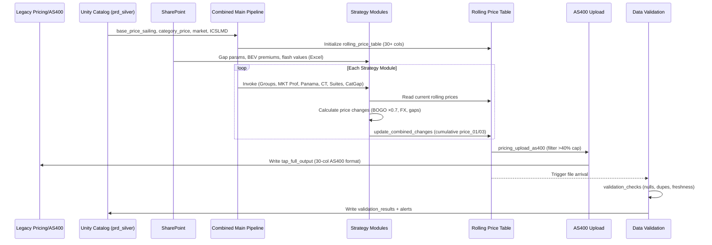

# OVERVIEW: TAP-RCI-dbricks

## 1. Project Overview

| Field | Detail |
|-------|--------|
| **Project Name** | TAP-RCI-dbricks (Targeted Availability Pricing — Royal Caribbean International) |
| **Purpose** | Automated dynamic pricing system for RCI cruise inventory. Calculates real-time price adjustments across multiple pricing strategies: Groups, Suites (lowering/raising), Market Profitability (multi-currency), Category Gapping, Cruise Tours, Panama/Caribbean (beverage premiums), GTY-Lead optimization, WTD adjustments, and Runaway Sailings. A combined nightly pipeline merges all strategy outputs into a rolling price table and uploads cumulative changes to the AS400 pricing system. |
| **Tech Stack** | Databricks (Azure), PySpark, Python 3.x, Delta Lake, Unity Catalog, Spark checkpointing, MSAL (SharePoint/Graph API), ADLS, Azure DevOps CI/CD |
| **Entry Points** | Primary: `TAP/rci_tap_combined_structure/nb_rci_tap_combined_main.py` (master nightly orchestrator). Standalone: `rci_tap_groups`, `rci_tap_market_prof`, `rci_tap_panama`, `rci_tap_cruise_tours`, `rci_tap_suites_lowering/raising`. Event-driven: `RCI_TAP_SUITES_UPLOAD` (file arrival trigger). |
| **Deployment Targets** | **Dev**: `adb-3692873619125232.12` / **QA**: `adb-2056111555648428.8` / **Prod**: `adb-7486609540090573.13` |
| **Dependencies** | `pyspark`, `pandas`, `numpy`, `pytz`, `requests`, `configparser`, `openpyxl` |

---

## 2. Directory Structure

```
TAP-RCI-dbricks/
├── databricks.yml                                 # Bundle config (3 targets)
├── .gitignore
│
├── azure-pipelines/                               # CI/CD (flake8, GenAI checks)
│   ├── ci-pipeline.yml
│   ├── .flake8
│   ├── project_config.yml
│   ├── genai_checks.md
│   └── rules_based_checks.json
│
├── resources/                                     # 13+ Databricks YAML workflows
│   ├── rci_tap_combined.yml                       # Master nightly (Mon/Thu/Fri 11:30 PM)
│   ├── rci_tap_groups.yml                         # Sat 12:00 PM
│   ├── rci_tap_market_prof.yml                    # Mon/Wed/Fri/Sat 12:30 PM
│   ├── rci_tap_panama.yml                         # Daily 12:30 PM
│   ├── rci_tap_cruise_tours.yml                   # Mon/Thu/Fri 11:30 PM
│   ├── rci_tap_suites_lowering.yml
│   ├── rci_tap_suites_raising.yml
│   ├── RCI_TAP_SUITES_CHANGES.yml
│   ├── RCI_TAP_SUITES_UPLOAD.yml                  # Event-driven (file arrival)
│   ├── RCI_GTY_LEAD_Optimization.yml
│   ├── RCI_GTY_LEAD_Model_Retraining.yml
│   ├── rci_tap_revert.yml
│   ├── rci_tap_runaway.yml
│   └── TAP_Data_Validation.yml                    # File arrival trigger
│
├── TAP/                                           # Main processing code
│   ├── COMMON/                                    # Shared utilities
│   │   ├── tap_functions.py                       # Core schema + AS400 upload
│   │   ├── price_upload_functions.py              # Advanced upload schemas
│   │   ├── sharepoint_functions.py                # MS Graph API integration
│   │   ├── Inventory_Table_Functions_And_Schemas.py
│   │   ├── KSF_SAILINGS.ipynb
│   │   └── Sharepoint.ipynb
│   │
│   ├── rci_tap_combined_structure/                # Master nightly orchestrator
│   │   ├── nb_rci_tap_combined_main.py            # Entry point
│   │   ├── nb_rci_tap_combined_parameters.py      # 6 market combos, BOGO 0.7
│   │   ├── nb_rci_tap_combined_prep_data.py       # Rolling price table init
│   │   └── nb_rci_tap_combined_functions.py       # update_combined_changes()
│   │
│   ├── rci_tap_groups/                            # Group pricing (4 files)
│   │   ├── nb_rci_tap_groups_main.py
│   │   ├── nb_rci_tap_groups_get_data.py
│   │   ├── nb_rci_tap_groups_logic.py             # FIT BOGO + flash sale - gap
│   │   └── nb_rci_tap_groups_update_sharepoint.py
│   │
│   ├── rci_tap_market_profitability/              # Multi-currency rebalancing (4 files)
│   │   ├── nb_rci_tap_market_profitability_main.py
│   │   ├── nb_rci_tap_market_profitability_get_data.py
│   │   ├── nb_rci_tap_market_profitability_logic.py  # FX + dilution + inversion
│   │   └── nb_rci_tap_market_profitability_sgd_logic.py  # SGD special
│   │
│   ├── rci_tap_panama/                            # Caribbean BEV premiums (4 files)
│   │   ├── nb_rci_tap_panama_main.py
│   │   ├── nb_rci_tap_panama_get_data.py
│   │   ├── nb_rci_tap_panama_logic.py
│   │   └── nb_rci_tap_panama_update_sharepoint.py
│   │
│   ├── rci_tap_cruise_tours/                      # Cruise tour premiums (3 files)
│   │   ├── nb_rci_tap_cruise_tours_main.py
│   │   ├── nb_rci_tap_cruise_tours_get_data.py
│   │   └── nb_rci_tap_cruise_tours_logic.py
│   │
│   ├── rci_tap_suites_lowering/                   # Suite price lowering (3 files)
│   │   ├── nb_rci_tap_suites_lowering_main.py
│   │   ├── nb_rci_tap_suites_lowering_get_data.py
│   │   └── nb_rci_tap_suites_lowering_logic.py
│   │
│   ├── rci_tap_suites_raising/                    # Suite price raising (3 files)
│   │   ├── nb_rci_tap_suites_raising_main.py
│   │   ├── nb_rci_tap_suites_raising_get_data.py
│   │   └── nb_rci_tap_suites_raising_logic.py
│   │
│   ├── rci_tap_category_gapping/                  # Category-level optimization (6 files)
│   │   ├── nb_rci_tap_category_gapping_main.py
│   │   ├── nb_rci_tap_category_gapping_parameters.py
│   │   ├── nb_rci_tap_category_gapping_get_data.py
│   │   ├── nb_rci_tap_category_gapping_prep_data.py
│   │   ├── nb_rci_tap_category_gapping_logic.py
│   │   └── nb_rci_tap_category_gapping_update_sharepoint.py
│   │
│   ├── CATEGORY_GAPPING/                          # ML trade-up models
│   │   ├── tradeup_config.py / tradeup_model.py
│   │   ├── rci_training_data.py / sailing_data.py
│   │   ├── quads_rci_training_data.py / quads_sailing_data.py
│   │   ├── tradeup_optimization.ipynb
│   │   ├── SharePoint.py
│   │   ├── DART/ (performance tracking)
│   │   └── Validations/ (pipeline QA)
│   │
│   ├── GTY_LEAD_GAPPING/                          # GTY-Lead optimization
│   │   ├── GTY_GAP_MAIN.py
│   │   ├── DATA_LOAD_GTY_GAP.py
│   │   ├── GTY_LEAD_OPTIMIZATION.py / GTY_LEAD_REFACTOR.py
│   │   ├── nb_gty_lead_gap_overrides.ipynb
│   │   ├── PARAMETERS/
│   │   ├── AUS_CAT_GAPPING/ / ICON_CAT_GAPPING/
│   │
│   ├── GROUP_GAPPING/                             # Legacy group gapping (9 files)
│   ├── Group_Gapping_Model/ (src/, config/, data/, model/)
│   │
│   ├── WTD_CHANGES/                               # Week-to-date adjustments (7 files)
│   │   ├── WTD_CHANGES_MAIN.py
│   │   ├── PARAMETERS.py / DATA_LOADING.py / FUNCTIONS.py
│   │   ├── MODEL.py / LOAD_CHECKPOINTS.py / LOAD_EXCLUSIONS.py
│   │
│   ├── TAP_SUITES/                                # Legacy suites modules (15+ files)
│   ├── SAFEGUARD/                                 # Pricing guardrails (4 files)
│   ├── RUNAWAY_SAILINGS/                          # Runaway sail detection (7 notebooks)
│   ├── NRF_REF_GAPPING/                           # Non-refundable reference (4 files)
│   ├── MARKET_PROFITABILITY/                      # Legacy market prof (2 files)
│   ├── MARKET_PROFITABILITY_LIVE/
│   ├── COMBINED_LIVE/                             # Legacy combined orchestration
│   ├── CRUISE_TOURS/ (legacy)
│   ├── TAP Panama/ / TAP_PROMO/
│   ├── GBP_REPRICE/ / PRE_RETRY/ / PRE_REVERT/
│   ├── Berthables_Missed_Opportunities/ (src/, config/, data/, model/)
│   ├── REPORTING_NOTEBOOKS/
│   │
│   ├── CLEANUP.py                                 # DB init + table truncation
│   ├── INVENTORY_REVENUE_TABLES.py                # Parquet data loading
│   ├── LIVE_PRICING_UPDATE.py                     # Live pricing query
│   ├── ENV_REV_MGMT_TABLE_UPDATING.py
│   ├── PRICE UPLOAD.py / PRICE UPLOAD - DIRECT.py
│   ├── Berthables.py / Berthables_Updated.py
│   │
│   └── Data_Validation/                           # QA framework (6 files)
│       ├── validation_checks.py                   # Core validation
│       ├── tables_validation.ipynb
│       ├── validation_trigger.ipynb
│       ├── tables_extractor.py                    # Databricks API connector
│       ├── config.ini
│       └── workflow_tables.ini
```

---

## 3. File-by-File Breakdown

### COMMON/ — Shared Utilities

| Field | `tap_functions.py` |
|---|---|
| **Purpose** | Core pricing schema definitions (30 columns) and AS400 upload logic. Maps English columns to AS400 field names (e.g., `SHIP_CODE` → `WKSHIP`). |
| **Key Function** | `pricing_upload_as400(df, schema, table)` — validates columns, filters price changes >40%, writes to `revstrat.tap_full_output`, logs exceptions |
| **Price Cap** | ±40% maximum change enforced; exceeding records → `tap_exceptions` table |

| Field | `sharepoint_functions.py` |
|---|---|
| **Purpose** | SharePoint integration for reading/writing gap parameters. Reads Excel files from `/sites/RCIPricingAutomation/Shared Documents/TAP/` |

### rci_tap_combined_structure/ — Master Pipeline

| Field | `nb_rci_tap_combined_main.py` |
|---|---|
| **Purpose** | **Primary entry point**: Master nightly orchestrator combining all pricing strategies into a rolling price table. Clears checkpoints, loads live pricing, routes by timezone (Australia at noon ET vs all others), calls each strategy module sequentially, each one updating the cumulative `rolling_price_table`. Final combined output uploaded to AS400. |
| **Schedule** | Mon/Thu/Fri 11:30 PM ET |
| **Checkpoint** | `dbfs:/FileStore/CheckpointedData/TAP_COMBINED` |

| Field | `nb_rci_tap_combined_parameters.py` |
|---|---|
| **Purpose** | Defines all processing filters. 6 market combos (MIA/USD, LON/GBP, AUS/AUD, SGP/SGD, SPA/EUR, MEX/MXN). `BOGO_PCT = 0.7`. Suite cab_class='D'. Excluded categories: WS (Wellness). |

| Field | `nb_rci_tap_combined_prep_data.py` |
|---|---|
| **Purpose** | Initializes rolling price table from live pricing joined with sailing metadata, category hierarchy, and category status. |
| **Sources** | `prd_silver.pricing.base_price_sailing`, `category_price`, `market`, `ICSLMD_COMPANION`, `meta_products`, `v_df_categories`, `ctgy_status` |

| Field | `nb_rci_tap_combined_functions.py` |
|---|---|
| **Key Function** | `update_combined_changes(project_name, output_data, pricing_table)` — joins project output to rolling price table, updates cumulative `price_01_amt`/`price_03_amt`, adds columns: `{project}_FLAG`, `{project}_price_change_01/03`, `{project}_tap_note`. Writes back (OVERWRITE mode). |

### rci_tap_groups/ — Group Pricing

| Field | `nb_rci_tap_groups_logic.py` |
|---|---|
| **Purpose** | Price groups at specified gap vs FIT (Standard) prices. Uses BOGO bundle (70%) plus flash sale reductions ($125–$300 by cabin class/nights). |
| **Formula** | `target = (FIT_BOGO - flash_per_person) × (1 - gap)` then unbundle by subtracting NCCF |
| **Parameters** | SharePoint: `TAP Group Gaps List.xlsx`; Flash values: `$125–$300` by (sail_night_group × cat_class) |

### rci_tap_market_profitability/ — Multi-Currency

| Field | `nb_rci_tap_market_profitability_logic.py` |
|---|---|
| **Purpose** | Multi-currency pricing based on USD base × FX rate × market gap index. Includes suite protection (never lower cat_class='D'), availability dilution (>90% booked → no lowering), inversion prevention (max 10 iterations), and closed category rules. |
| **Formula** | `final = (USD_BOGO / fx_rate) × gap ÷ 0.7 - NCCF` |
| **Markets** | ASIA, EUROPE, 7N CARIBBEAN (from PCN/MIA/FLL/TPA), ALASKA |
| **SGD Logic** | Separate `nb_rci_tap_market_profitability_sgd_logic.py` for Singapore Dollar |

### rci_tap_panama/ — Caribbean/BEV Premiums

| Field | `nb_rci_tap_panama_logic.py` |
|---|---|
| **Purpose** | Caribbean International pricing with beverage package premiums by GTY type. |
| **GTY Types** | Quad: XQ, NQ, YQ, ZQ; Double: XB, XN, YO, ZI, WS |
| **Parameters** | SharePoint: `BEV_PACKAGE_PREMIUM.xlsx` |

### rci_tap_suites_lowering/ & rci_tap_suites_raising/

| Field | Suites Lowering / Raising |
|---|---|
| **Purpose** | Strategic suite price reduction and increase. Excludes GALAPAGOS, AFRICA, S_AMERICA, CUBA, ASIA, DUBAI, WORLD, CHINA. |
| **Cabin Class** | `D` (suite) only |

### WTD_CHANGES/ — Week-to-Date

| Field | `WTD_CHANGES_MAIN.py` |
|---|---|
| **Purpose** | Intra-week price adjustments comparing WTD sales performance vs plan. `MODEL.py` calculates track variance and determines raise/lower actions by category class or entire sailing. |

### Data_Validation/ — QA Framework

| Field | `validation_checks.py` |
|---|---|
| **Purpose** | `ValidationRunnerHistory` class — validates table existence, schema, freshness, nulls, PK duplicates, hash duplicates, categorical cardinality. Compares against prior runs via Delta history. |
| **Trigger** | File arrival: `/Volumes/{env}_ml_ops/validation_checks/validation_checkpoint/TAP/` |

---

## 4. File Relationship Map

```mermaid
flowchart TD
    subgraph COMMON["COMMON/ — Shared"]
        TAP_FN["tap_functions.py<br/>Schema + AS400 upload"]
        SP_FN["sharepoint_functions.py<br/>MS Graph API"]
        PRICE_UP["price_upload_functions.py"]
    end

    subgraph COMBINED["rci_tap_combined_structure/ — Master Pipeline"]
        MAIN["nb_rci_tap_combined_main.py<br/>Entry point"]
        PARAMS["nb_rci_tap_combined_parameters.py"]
        PREP["nb_rci_tap_combined_prep_data.py"]
        FUNCS["nb_rci_tap_combined_functions.py<br/>update_combined_changes()"]
    end

    subgraph STRATEGIES["Pricing Strategy Modules"]
        GROUPS["rci_tap_groups/<br/>Group gap pricing"]
        MKT["rci_tap_market_profitability/<br/>Multi-currency FX"]
        PANAMA["rci_tap_panama/<br/>BEV premiums"]
        CT["rci_tap_cruise_tours/<br/>Tour premiums"]
        SUITES_L["rci_tap_suites_lowering/"]
        SUITES_R["rci_tap_suites_raising/"]
        CAT_GAP["rci_tap_category_gapping/"]
        WTD["WTD_CHANGES/<br/>Week-to-date"]
    end

    subgraph ML["CATEGORY_GAPPING/ — ML"]
        TRADEUP["tradeup_model.py"]
        TRAIN["rci_training_data.py"]
    end

    subgraph GTY["GTY_LEAD_GAPPING/"]
        GTY_MAIN["GTY_GAP_MAIN.py"]
        GTY_OPT["GTY_LEAD_OPTIMIZATION.py"]
    end

    subgraph VALIDATION["Data_Validation/"]
        VAL_CHECKS["validation_checks.py"]
        VAL_TRIGGER["validation_trigger.ipynb"]
    end

    subgraph EXTERNAL["External Systems"]
        UC[("Unity Catalog<br/>(prd_silver.*)")]
        SP[("SharePoint<br/>(Gap Lists, BEV)")]
        ADLS[("ADLS<br/>(Parquet)")]
        AS400[("AS400<br/>Pricing System")]
    end

    MAIN --> PARAMS
    MAIN --> PREP
    MAIN --> FUNCS
    MAIN -->|calls| GROUPS
    MAIN -->|calls| MKT
    MAIN -->|calls| PANAMA
    MAIN -->|calls| CT
    MAIN -->|calls| SUITES_L
    MAIN -->|calls| SUITES_R
    MAIN -->|calls| CAT_GAP

    GROUPS -->|imports| TAP_FN
    MKT -->|imports| TAP_FN
    PANAMA -->|imports| TAP_FN
    CT -->|imports| TAP_FN
    SUITES_L -->|imports| TAP_FN
    SUITES_R -->|imports| TAP_FN

    GROUPS -->|reads| SP_FN
    MKT -->|reads| SP_FN
    PANAMA -->|reads| SP_FN
    CAT_GAP -->|reads| SP_FN

    PREP -->|reads| UC
    SP -->|gap params| SP_FN
    UC -->|live pricing| PREP

    FUNCS -->|writes| ADLS
    TAP_FN -->|upload| AS400

    CAT_GAP -->|uses| TRADEUP
    GTY_MAIN -->|uses| GTY_OPT
    TRAIN -->|feeds| TRADEUP

    MAIN -->|triggers| VAL_TRIGGER
    VAL_TRIGGER -->|runs| VAL_CHECKS

    style COMMON fill:#e8f4fd,stroke:#004ecc
    style COMBINED fill:#fff8e1,stroke:#f9a825
    style STRATEGIES fill:#e6faf4,stroke:#10a4b7
    style ML fill:#fff3e0,stroke:#e65100
    style VALIDATION fill:#f3e5f5,stroke:#6a1b9a
    style EXTERNAL fill:#f5f5f5,stroke:#616161
```



---

## 5. Data Flow



---

## 6. Configuration & Environment

### Environment Variables

| Variable | Required | Description |
|---|---|---|
| `catalog_env` | **Yes** | `dev`, `qa`, or `prd` — set via `${bundle.target}` |

### Databricks Bundle Variables

| Variable | Description |
|---|---|
| `xsmall/small/medium_warehouse_id` | SQL warehouse IDs per environment |
| `job_service_principal` | Service principal for job execution |
| `workflow_status` | `PAUSED` (QA) / `UNPAUSED` (Prod) |
| `multinode_policy_id` / `singlenode_policy_id` | Compute policies |
| `failure_notification_emails` | Alert recipients (incl. PagerDuty in Prod) |

### Database Schemas

| Schema | Direction | Description |
|---|---|---|
| `prd_silver.pricing.*` | Read | `base_price_sailing`, `category_price`, `market` |
| `prd_silver.mkrpuser.*` | Read | `ICSLMD_COMPANION`, `ctgy_status` |
| `prd_silver.mkrp_rmd.*` | Read | `meta_products`, `v_df_categories` |
| `{env}_revenue_mgmt_bu.combined.*` | Read/Write | `rolling_price_table` (master state) |
| `{env}_revenue_mgmt_bu.revstrat.*` | Write | `tap_full_output`, `tap_exceptions`, strategy validations |
| `{env}_ml_ops.validation_checks.*` | Write | QA results |

### Workflows (13+ Databricks Jobs)

| Workflow | Schedule | Purpose |
|---|---|---|
| `rci_tap_combined` | Mon/Thu/Fri 11:30 PM | Master nightly (all strategies) |
| `rci_tap_groups` | Sat 12:00 PM | Group gap pricing |
| `rci_tap_market_prof` | Mon/Wed/Fri/Sat 12:30 PM | Multi-currency rebalancing |
| `rci_tap_panama` | Daily 12:30 PM | Caribbean BEV premiums |
| `rci_tap_cruise_tours` | Mon/Thu/Fri 11:30 PM | Cruise tour premiums |
| `rci_tap_suites_lowering` | Scheduled | Suite price reductions |
| `rci_tap_suites_raising` | Scheduled | Suite price increases |
| `RCI_TAP_SUITES_UPLOAD` | Event-driven (file arrival) | Suite upload + validation |
| `RCI_GTY_LEAD_Optimization` | Scheduled | GTY-Lead gap optimization |
| `RCI_GTY_LEAD_Model_Retraining` | Scheduled | ML model retraining |
| `rci_tap_runaway` | Scheduled | Runaway sailing detection |
| `TAP_Data_Validation` | File arrival trigger | Data quality checks |

### Key Business Parameters

| Parameter | Value | Used By |
|---|---|---|
| `BOGO_PCT` | 0.7 (70%) | Groups, Market Prof, Category Gapping |
| `Price Cap` | ±40% | All strategies (tap_functions.py) |
| `Flash Sale` | $125–$300 per person | Groups |
| Markets | MIA/USD, LON/GBP, AUS/AUD, SGP/SGD, SPA/EUR, MEX/MXN | Market Profitability |
| Brand | `R` (Royal Caribbean) | All strategies |
